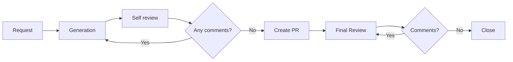
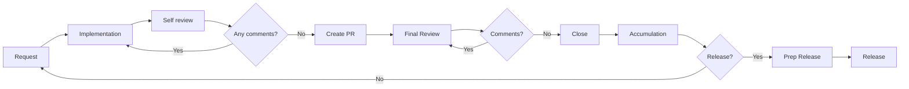

# AI-Assisted Development Playbook

> **Note:** This translation was performed by Gemini CLI (gemini-3-pro-preview).

This repository contains the configuration and rules used for the AI-assisted development of the [TasK](https://task.ai-aid.pro/) project. It serves as a public example of organizing documentation and workflows for AI agents (within Gemini CLI, Codex CLI, Kilo Code, or similar environments). Here you will find rules, role instructions, and templates that enable effective development management using LLMs.

I am publishing these materials as an example of a real-world workflow to share my experience, discuss AI development approaches, and find ways to improve them together. You are free to study, adapt, and apply these practices in your own projects.

## My Workflow

I have arrived at an approach I call **Task-driven development** — development driven by tasks as specifications.

In this approach, the unit of truth is not a "general requirement description," but a specific task (or epic) formatted according to a strict template. The task acts as a specification for execution: it defines the goal, boundaries (scope / out of scope), acceptance criteria, and mandatory checks. If necessary, it includes requirements for tests (unit, integration, e2e). Implementation is considered ready only after confirming compliance with the task: passing checks, executing tests, and a final review. Otherwise, the task is refined, and the cycle repeats.

**Difference from Spec-driven development.** Spec-driven development is built around a separate specification artifact (API contract, behavioral scenarios, formal model) against which the implementation is written. In task-driven development, the specification is "packaged" directly into the task: the task = the spec. Task setting becomes the central element of the process, and development becomes the process of proving that the code satisfies the task's formulations.

## 🧠 Core Manifesto (AGENTS.md)

The [AGENTS.md](./AGENTS.md) file is the entry point and "constitution" for the AI agent. It contains the following sections:
* **Mission** and rule priority.
* **Role** — selecting a specialized role before starting work.
* **Reflection** — assessing task complexity, context, and risks.
* **Language** — communication and naming rules.
* **Project Architecture** — stack, infrastructure, folder structure, migrations, modules, and layers.
* **Working with Code** — Git-flow, branches, task management, and technical debt.
* **Tests and Validation** — test types, tools, and `make check`.
* **Pre-checks** — requirements before submitting a task.
* **Pull Requests** and **Commit Format**.
* **Documentation** and **Prohibitions**.
* **Mini-checklist (for self-check)**.

## 🎭 Agent Roles

Depending on the task, the agent assumes one of the specialized roles. Role descriptions are located in `docs/agents/roles/team/` (files are in Russian):

* **[Analyst](docs/agents/roles/team/system_analyst.md)** — requirements analysis and decomposition.
* **[Architect](docs/agents/roles/team/system_architect.md)** — system design and integrity control.
* **[Team Lead](docs/agents/roles/team/team_lead.md)** — coordination and decision making.
* **[Backend Developer](docs/agents/roles/team/backend_developer.md)** — server-side development.
* **[Frontend Developer](docs/agents/roles/team/frontend_developer.md)** — client-side development.
* **[DevOps](docs/agents/roles/team/devops_engineer.md)** — infrastructure and CI/CD.
* **[Product Owner (PO)](docs/agents/roles/team/product_owner.md)** — product management.
* **[QA (Backend)](docs/agents/roles/team/qa_backend.md) / [QA (Frontend)](docs/agents/roles/team/qa_frontend.md)** — testing.
* **[Code Reviewer (Backend)](docs/agents/roles/team/code_reviewer_backend.md)** — code quality check.

## 📝 Task Management (Todo)

A file-based task management system in the [`todo/`](./todo/) directory is used for setting tasks. This allows the agent to receive tasks as part of the project context.

* **[Task Rules](./todo/AGENTS.md)** — instructions on the task life cycle (creation, execution, completion).
* **[Task Template](./todo/templates/task.md)** — file structure for a single task.
* **[Epic Template](./todo/templates/epic.md)** — structure for large features and stories.

## 🚀 How It Works

Everything is built on `AGENTS.md` — a file with project rules and conventions. Processes, templates, and transition rules are described there, ensuring the agent works predictably and results are repeatable.

The processes and documents are not final — I am constantly improving them. The goals are to increase the quality of the agent's solutions and its autonomy. The more I trust the agent, the less I participate in development.

I no longer write code by hand — only minor edits and markdown documents. But my participation is still significant: I cannot trust models 100%, and I have to verify. The agent breaks project rules, layer isolation, namespace and class naming, and writes redundant tests.

### Task Setting Process

1. **Request.** I make a request to the AI agent. Example: `Take on the role of an analyst. I need a status page for the project, create an epic for this task.`
2. **Generation.** The agent loads the role, task setting requirements, and templates — and generates the task text.
3. **Self-review.** I ask the agent to check itself. If a specific direction (architecture, devops, frontend, backend) needs work, I ask it to take the corresponding role.
4. **Refinement.** If there are comments, I ask for corrections and we return to step 2.
5. **PR Creation.** If everything is fine, I ask the agent to create a PR.
6. **Final Review.** I check the task setting myself, going through "comment — correction" iterations with the agent.
7. **Closing.** I merge the PR and inform the agent. It deletes the branch, switches to master, selects the next task, and proposes to start.

### Task Implementation Process

The process is similar to task setting, but the agent performs more checks independently before showing me the code.

1. **Request.** Example: `You are a [Backend Developer](docs/agents/roles/team/backend_developer.md). Take the task todo/EPIC-status-page.todo.md to work.`
2. **Implementation.** The agent fulfills the task requirements and runs checks itself: tests (PHPUnit), static analysis (PHPMD, Deptrac, Psalm), style validation (PHP_CodeSniffer), build (Composer). This creates a self-validation cycle — the agent delivers code that is already clean enough.
3. **Self-review.** I ask the agent to check the solution. I can ask it to take a role (architecture, devops, frontend, backend) and run checks sequentially.
4. **Refinement.** If there are comments, I ask for corrections and we return to step 2.
5. **PR Creation.** If everything is fine, I ask the agent to create a PR.
6. **Final Review.** I check the code myself, going through "comment — correction" iterations with the agent.
7. **Closing.** I merge the PR and inform the agent. It deletes the branch, switches to master, selects the next task.
8. **Accumulation.** Tasks accumulate for the release.
9. **Release Preparation.** I ask the agent to run e2e tests and prepare the release: tag, changelog, publication on GitHub.
10. **Release.** I deploy to prod: configurations, dependencies, migrations, supervisor restart. Then — post-checks.

### 📸 Example with Screenshots

[In my blog](https://prikotov.pro/blog/pervyi-opyt-s-glm-5-koding-cherez-kilo-code#primer-raboty-v-kilo-code) — a detailed walkthrough of a real AI agent session with screenshots: from request to finished PR. Shows how the agent works with this playbook in practice.
