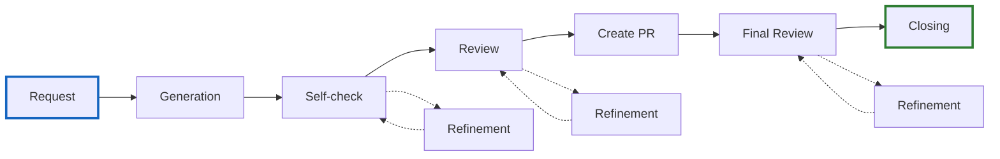
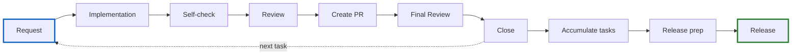
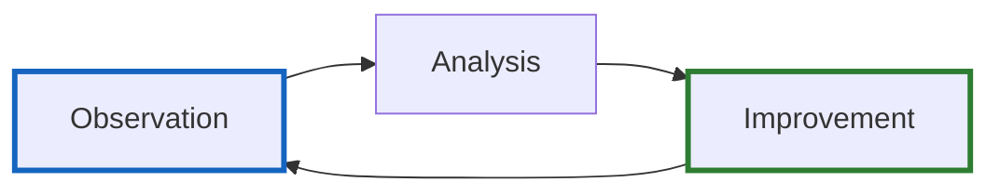

# AI-Assisted Development Playbook

[](README.md)
[](README.zh.md)

> **Note:** This translation was performed by Gemini CLI (gemini-3-flash-preview).

This repository contains the configuration and rules used for the AI-assisted development of the [TasK](https://task.ai-aid.pro/) project. It serves as a public example of organizing documentation and workflows for AI agents (within Gemini CLI, Codex CLI, Kilo Code, or similar environments). Here you will find rules, role instructions, and templates that enable effective development management using LLMs.

I am publishing these materials as an example of a real-world workflow to share my experience, discuss AI development approaches, and find ways to improve them together. You are free to study, adapt, and apply these practices in your own projects.

## Workflow

I have arrived at an approach I call **Task-driven development** — development driven by tasks as specifications.

In this approach, the unit of truth is not a "general requirement description," but a specific task (or epic) formatted according to a strict template. The task acts as a specification for execution: it defines the goal, boundaries (scope / out of scope), acceptance criteria, and mandatory checks. If necessary, it includes requirements for tests (unit, integration, e2e). Implementation is considered ready only after confirming compliance with the task: passing checks, executing tests, and a final review. Otherwise, the task is refined, and the cycle repeats.

**Difference from Spec-driven development.** Spec-driven development is built around a separate specification artifact (API contract, behavioral scenarios, formal model) against which the implementation is written. In task-driven development, the specification is "packaged" directly into the task: the task = the spec. Task setting becomes the central element of the process, and development becomes the process of proving that the code satisfies the task's formulations.

## 🧠 Core Manifesto (AGENTS.md)

The [AGENTS.md](./AGENTS.en.md) file is the entry point and "constitution" for the AI agent. It contains the following sections:
* **Mission** and rule priority.
* **Role** — selecting a specialized role before starting work.
* **Reflection** — assessing task complexity, context, and risks.
* **Language** — communication and naming rules.
* **Project Architecture** — stack, infrastructure, folder structure, migrations, modules, and layers.
* **Working with Code** — Git-flow, branches, task management, and technical debt.
* **Tests and Validation** — test types, tools, and `make check`.
* **Pre-checks** — requirements before submitting a task.
* **Pull Requests** and **Commit Format**.
* **Documentation** and **Prohibitions**.
* **Mini-checklist (for self-check)**.

## 🎭 Agent Roles

Depending on the task, the agent assumes one of the specialized roles. Role descriptions are located in `docs/agents/roles/team/` (files are in Russian):

* **[Product Owner (PO)](docs/agents/roles/team/product_owner.en.md)** — product management.
* **[Analyst](docs/agents/roles/team/system_analyst.en.md)** — requirements analysis and decomposition.
* **[Architect](docs/agents/roles/team/system_architect.en.md)** — system design and integrity control.
* **[Lead](docs/agents/roles/team/team_lead.en.md)** — coordination and decision making.
* **[Backend Developer](docs/agents/roles/team/backend_developer.en.md)** — server-side development.
* **[UI/UX Designer](docs/agents/roles/team/ui_ux_designer.en.md)** — user experience and interface design.
* **[Frontend Developer](docs/agents/roles/team/frontend_developer.en.md)** — client-side development.
* **[DevOps](docs/agents/roles/team/devops_engineer.en.md)** — infrastructure and CI/CD.
* **[Backend Reviewer](docs/agents/roles/team/code_reviewer_backend.en.md)** — code quality check.
* **[Frontend Reviewer](docs/agents/roles/team/code_reviewer_frontend.en.md)** — UI/UX and code quality check.
* **[DevOps Reviewer](docs/agents/roles/team/code_reviewer_devops.en.md)** — infrastructure and security review.
* **[Backend QA](docs/agents/roles/team/qa_backend.en.md)** — server-side testing.
* **[Frontend QA](docs/agents/roles/team/qa_frontend.en.md)** — client-side testing.
* **[Technical Writer](docs/agents/roles/team/technical_writer.en.md)** — user documentation and help.
* **[Copywriter](docs/agents/roles/team/copywriter.en.md)** — content marketing and storytelling.

**Examples of addressing roles in a request:**
* `Backend Developer take the task from todo/EPIC-status-page.todo.md to work`
* `DevOps check the changes in devops/nginx/conf.d/dev/task.conf, do we need everything there? Are we overcomplicating it?`
* `Frontend Developer review the file apps/web/assets/controllers/notification-toast_controller.js`

## 📝 Task Management (Todo)

A file-based task management system in the [`todo/`](./todo/) directory is used for setting tasks. This allows the agent to receive tasks as part of the project context.

* **[Task Rules](./todo/AGENTS.md)** — instructions on the task life cycle (creation, execution, completion).
* **[Task Template](./todo/templates/task.md)** — file structure for a single task.
* **[Epic Template](./todo/templates/epic.md)** — structure for large features and stories.

## 🚀 How It Works

Everything is built on `AGENTS.md` — a file with project rules and conventions. Processes, templates, and transition rules are described there, ensuring the agent works predictably and results are repeatable.

The processes and documents are not final — I am constantly improving them. The goals are to increase the quality of the agent's solutions and its autonomy. The more I trust the agent, the less I participate in development.

I no longer write code by hand — only minor edits and markdown documents. But my participation is still significant: I cannot trust models 100%, and I have to verify. The agent breaks project rules, layer isolation, namespace and class naming, and writes redundant tests.

### Task Setting Process

Work usually begins with setting a task or epic. Code comes next.

Example request:

```
Take on the role of an analyst. I need a status page for the project. Create an epic for this task.
```

The process is as follows:

1. **Request.** I assign a role and a goal.
2. **Generation.** The agent loads the role, task setting rules, templates and writes the epic.
3. **Self-check.** I ask the agent to double-check itself and fix weak spots.
4. **Review.** I ask another role to review the task: architect, reviewer, QA, devops.
5. **PR Creation.** The agent puts changes on a separate branch and creates a PR.
6. **Final Review.** I read the task myself and provide feedback.
7. **Closing.** The agent merges the PR, deletes the branch, returns to master and waits for the next command.


```mermaid
flowchart LR
    A["Request"] --> B["Generation"]
    B --> C["Self-check"]

    C --> D["Review"]
    C -.-> C1["Refinement"]
    C1 -.-> C

    D --> E["Create PR"]
    D -.-> D1["Refinement"]
    D1 -.-> D

    E --> F["Final Review"]

    F --> G["Closing"]
    F -.-> F1["Refinement"]
    F1 -.-> F

    classDef start stroke:#1565c0,stroke-width:3px;
    classDef finish stroke:#2e7d32,stroke-width:3px;

    class A start;
    class G finish;
```

> *"Better to lose a day, then fly there in five minutes"*<br/>
> *— folk wisdom*

A bad task almost guarantees a bad solution. A good task doesn't guarantee a perfect solution, but it reduces the "check → fix" cycle at final review.

### Task Implementation Process

Implementation is similar to planning, only instead of task text the agent changes code.

Example request:

```
Backend developer, take the task from todo/EPIC-status-page.todo.md to work.
```

The process:

1. **Request.** I assign a role and point to the task file.
2. **Implementation.** The agent writes code, tests, migrations, documentation.
3. **Checks.** Runs PHPUnit, PHPCS, Psalm, Deptrac, PHPMD, Composer or `make check`.
4. **Self-check.** Reviews its own solution.
5. **Role review.** Another role examines architecture, tests, UX or infrastructure.
6. **PR.** The agent creates a pull request.
7. **Final Review.** I read the result and go through "feedback → fix" cycles with the agent.
8. **Merge.** The agent merges, deletes the branch, returns to master.
9. **Release.** Before release the agent runs e2e, prepares changelog and tag. I deploy to prod myself.


```mermaid
flowchart LR
    A["Request"] --> B["Implementation"]
    B --> C["Self-check"]
    C --> D["Review"]
    D --> E["Create PR"]
    E --> F["Final Review"]
    F --> G["Close"]

    G -.->|"next task"| A

    G --> H["Accumulate tasks"]
    H --> I["Release prep"]
    I --> J["Release"]

    classDef start stroke:#1565c0,stroke-width:3px;
    classDef release stroke:#2e7d32,stroke-width:3px;

    class A start;
    class J release;
```

The value of this process is in separating stages. The agent doesn't do everything in one jump: first it implements, then checks itself, then passes the result to another role, and only then hands it to the human for final review. This separation of stages, combined with preliminary task planning, improves implementation quality and reduces the time the human spends on final review.

### Final Review

At final review I look not so much at the implementation itself, but at whether the code follows project rules: conventions, module isolation, `High cohesion, low coupling`, bounded contexts and ubiquitous language of the domain.

I also check what hasn't yet been moved into deterministic tools: strange decisions, unnecessary complexity, security violations and obvious nonsense. If something seems off, I usually ask the agent why it did it that way. Then I either agree or the agent reworks it.

I barely look at test code: I open it rarely, when I need to verify a specific scenario or a test failure cause.

I separately check PR formatting. For example, I want the agent to label its PRs — these labels feed into reports on the share of agent work.

I read changes to agent rules more carefully than regular code. A good rule pays off greatly, but agents don't always write good rules for themselves: often verbose and off-point. I think this can be improved by spending time teaching agents to write such rules better. For now I prefer to proofread these changes by hand.

At final review I also capture recurring agent mistakes. These later become new rules, checks and process refinements.

### Continuous Improvement Process (Retrospective)

Retrospectives are needed to increase the agent's autonomy and work quality. I look at which problems recur and turn them into rules, checks, templates or process clarifications.

The cycle:

1. **Observation.** I watch the agent's work during the process and at review. I note failures, context misunderstandings, unnecessary actions and errors.
2. **Analysis.** I identify recurring patterns that waste time and tokens. I look for a systemic solution: what to change in an instruction, template or tool so the error doesn't recur.
3. **Improvement.** I make a targeted edit to `AGENTS.md`, a role, task template, documentation, linter config, Deptrac rule, sniff or test.


```mermaid
flowchart LR
    A["Observation"] --> B["Analysis"]
    B --> C["Improvement"]
    C --> A

    classDef start stroke:#1565c0,stroke-width:3px;
    classDef finish stroke:#2e7d32,stroke-width:3px;

    class A start;
    class C finish;
```

> It's important to follow the principle of isolated changes. Don't change everything at once — it's impossible to track the impact of a specific edit that way. Improvements should be introduced in small increments and the effect verified immediately.

Example of a real epic and result: [status page epic](https://github.com/prikotov/task-agents-playbook/blob/main/todo/EPIC-status-page.todo.md) and its [implementation on task.ai-aid.pro](https://task.ai-aid.pro/status).

## 📂 Implementation Examples

To better understand how these rules work in practice, you can examine real artifacts created by AI agents:

*   **[Epic Example](./todo/EPIC-status-page.todo.md)** — a full specification for a major feature (Status Page), created by an agent in the Analyst role.
*   **Tasks** — the [`todo/`](./todo/) and [`todo/done/`](./todo/done/) directories contain specific task files into which this epic was decomposed.
*   **Code Examples** — implementation logic written by an agent based on these tasks:
    *   [Core](./src/Module/Health) — logic, services, and integrations.
    *   [Web](./apps/web/src/Module/Health) — controllers and page templates.
*   **Test Examples** — tests created by the agent to verify the implementation:
    *   [Core Tests](./tests) — unit and integration tests.
    *   [Web Tests](./apps/web/tests) — unit and e2e tests.

### 📸 Example with Screenshots

[In my blog](https://prikotov.pro/blog/pervyi-opyt-s-glm-5-koding-cherez-kilo-code#primer-raboty-v-kilo-code) (in Russian) — a detailed walkthrough of a real AI agent session with screenshots: from request to finished PR. Shows how the agent works with this playbook in practice.

---

## 📦 Practical Implementation (May 2026)

This guide's methodology is implemented as a set of Composer packages — each one instrumentally embodies a specific element of the approach (conventions, tasks, roles, git workflow). Together they form a ready-to-use project skeleton:

**[prikotov/symfony-ddd-ai-skeleton](https://github.com/prikotov/symfony-ddd-ai-skeleton)** — a reusable Symfony 8 / PHP 8.4 skeleton with modular DDD/CQRS, multi-app kernel, AI-agent-friendly workflow (`AGENTS.md`, roles, conventions, todo-md) and built-in automated quality checks (`make check`). Suitable as a starting point for projects with a complex domain where modular architecture and DDD help manage complexity.

Companion packages implementing individual elements of the approach:

| Package | Purpose |
|---------|----------|
| [prikotov/coding-standard](https://github.com/prikotov/coding-standard) | Conventions — coding standards describing principles, patterns, layers, modules and structure of a Symfony application. Automated checks (PHPCS, Deptrac, PHPStan) enforce compliance with conventions |
| [prikotov/todo-md](https://github.com/prikotov/todo-md) | Task management system: tasks stored as markdown files with YAML front matter, statuses changed by moving between folders, templates and references help AI agents create and track tasks |
| [prikotov/task-orchestrator](https://github.com/prikotov/task-orchestrator) | Console agent orchestrator: roles with behavioral profiles (DISC, Big Five), skills, sub-agents in isolated context, step chains in YAML, role validation |
| [prikotov/git-workflow](https://github.com/prikotov/git-workflow) | Git workflow rules: branch naming, commit format (Conventional Commits), pull request process, code review, release, deploy and secrets protection |

More about how and why I arrived at this approach — in the article: [«AI coding agents: how I prepared the project»](https://prikotov.pro/blog/ii-agenty-dlya-programmirovaniya-kak-ya-podgotovil-proekt) (in Russian).
