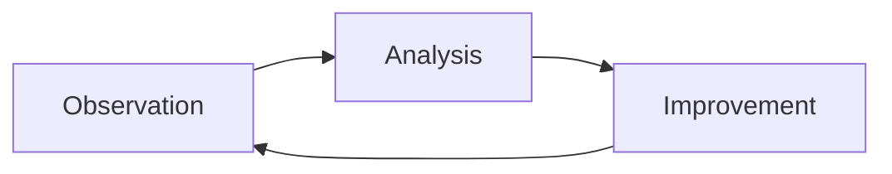

# AI-Assisted Development Playbook

> **Note:** This translation was performed by Gemini CLI (gemini-3-flash-preview).

This repository contains the configuration and rules used for the AI-assisted development of the [TasK](https://task.ai-aid.pro/) project. It serves as a public example of organizing documentation and workflows for AI agents (within Gemini CLI, Codex CLI, Kilo Code, or similar environments). Here you will find rules, role instructions, and templates that enable effective development management using LLMs.

I am publishing these materials as an example of a real-world workflow to share my experience, discuss AI development approaches, and find ways to improve them together. You are free to study, adapt, and apply these practices in your own projects.

## Workflow

I have arrived at an approach I call **Task-driven development** — development driven by tasks as specifications.

In this approach, the unit of truth is not a "general requirement description," but a specific task (or epic) formatted according to a strict template. The task acts as a specification for execution: it defines the goal, boundaries (scope / out of scope), acceptance criteria, and mandatory checks. If necessary, it includes requirements for tests (unit, integration, e2e). Implementation is considered ready only after confirming compliance with the task: passing checks, executing tests, and a final review. Otherwise, the task is refined, and the cycle repeats.

**Difference from Spec-driven development.** Spec-driven development is built around a separate specification artifact (API contract, behavioral scenarios, formal model) against which the implementation is written. In task-driven development, the specification is "packaged" directly into the task: the task = the spec. Task setting becomes the central element of the process, and development becomes the process of proving that the code satisfies the task's formulations.

## 🧠 Core Manifesto (AGENTS.md)

The [AGENTS.md](./AGENTS.en.md) file is the entry point and "constitution" for the AI agent. It contains the following sections:
* **Mission** and rule priority.
* **Role** — selecting a specialized role before starting work.
* **Reflection** — assessing task complexity, context, and risks.
* **Language** — communication and naming rules.
* **Project Architecture** — stack, infrastructure, folder structure, migrations, modules, and layers.
* **Working with Code** — Git-flow, branches, task management, and technical debt.
* **Tests and Validation** — test types, tools, and `make check`.
* **Pre-checks** — requirements before submitting a task.
* **Pull Requests** and **Commit Format**.
* **Documentation** and **Prohibitions**.
* **Mini-checklist (for self-check)**.

## 🎭 Agent Roles

Depending on the task, the agent assumes one of the specialized roles. Role descriptions are located in `docs/agents/roles/team/` (files are in Russian):

* **[Product Owner (PO)](docs/agents/roles/team/product_owner.en.md)** — product management.
* **[Analyst](docs/agents/roles/team/system_analyst.en.md)** — requirements analysis and decomposition.
* **[Architect](docs/agents/roles/team/system_architect.en.md)** — system design and integrity control.
* **[Lead](docs/agents/roles/team/team_lead.en.md)** — coordination and decision making.
* **[Backend Developer](docs/agents/roles/team/backend_developer.en.md)** — server-side development.
* **[UI/UX Designer](docs/agents/roles/team/ui_ux_designer.en.md)** — user experience and interface design.
* **[Frontend Developer](docs/agents/roles/team/frontend_developer.en.md)** — client-side development.
* **[DevOps](docs/agents/roles/team/devops_engineer.en.md)** — infrastructure and CI/CD.
* **[Backend Reviewer](docs/agents/roles/team/code_reviewer_backend.en.md)** — code quality check.
* **[Frontend Reviewer](docs/agents/roles/team/code_reviewer_frontend.en.md)** — UI/UX and code quality check.
* **[DevOps Reviewer](docs/agents/roles/team/code_reviewer_devops.en.md)** — infrastructure and security review.
* **[Backend QA](docs/agents/roles/team/qa_backend.en.md)** — server-side testing.
* **[Frontend QA](docs/agents/roles/team/qa_frontend.en.md)** — client-side testing.
* **[Technical Writer](docs/agents/roles/team/technical_writer.en.md)** — user documentation and help.
* **[Copywriter](docs/agents/roles/team/copywriter.en.md)** — content marketing and storytelling.

**Examples of addressing roles in a request:**
* `Backend Developer take the task from todo/EPIC-status-page.todo.md to work`
* `DevOps check the changes in devops/nginx/conf.d/dev/task.conf, do we need everything there? Are we overcomplicating it?`
* `Frontend Developer review the file apps/web/assets/controllers/notification-toast_controller.js`

**Examples of addressing roles in a request:**
* `Backend Developer take the task from todo/EPIC-status-page.todo.md to work`
* `DevOps check the changes in devops/nginx/conf.d/dev/task.conf, do we need everything there? Are we overcomplicating it?`
* `Frontend Developer review the file apps/web/assets/controllers/notification-toast_controller.js`

## 📝 Task Management (Todo)

A file-based task management system in the [`todo/`](./todo/) directory is used for setting tasks. This allows the agent to receive tasks as part of the project context.

* **[Task Rules](./todo/AGENTS.md)** — instructions on the task life cycle (creation, execution, completion).
* **[Task Template](./todo/templates/task.md)** — file structure for a single task.
* **[Epic Template](./todo/templates/epic.md)** — structure for large features and stories.

## 🚀 How It Works

Everything is built on `AGENTS.md` — a file with project rules and conventions. Processes, templates, and transition rules are described there, ensuring the agent works predictably and results are repeatable.

The processes and documents are not final — I am constantly improving them. The goals are to increase the quality of the agent's solutions and its autonomy. The more I trust the agent, the less I participate in development.

I no longer write code by hand — only minor edits and markdown documents. But my participation is still significant: I cannot trust models 100%, and I have to verify. The agent breaks project rules, layer isolation, namespace and class naming, and writes redundant tests.

### Task Setting Process

1. **Request.** I make a request to the AI agent. Example: `Take on the role of an analyst. I need a status page for the project, create an epic for this task.`
2. **Generation.** The agent loads the role, task setting requirements, and templates — and generates the task text.
3. **Self-review.** I ask the agent to check itself. If a specific direction (architect, devops, frontend/backend developer) needs work, I ask it to take the corresponding role.
4. **Refinement.** If there are comments, I ask for corrections and we return to step 2.
5. **PR Creation.** If everything is fine, I ask the agent to create a PR.
6. **Final Review.** I check the task setting myself, going through "comment — correction" iterations with the agent.
7. **Closing.** I merge the PR and inform the agent. It deletes the branch, switches to master, selects the next task, and proposes to start.

### Task Implementation Process

The process is similar to task setting, but the agent performs more checks independently before showing me the code.

1. **Request.** Example: `You are a [Backend Developer](docs/agents/roles/team/backend_developer.en.md). Take the task todo/EPIC-status-page.todo.md to work.`
2. **Implementation.** The agent fulfills the task requirements and runs checks itself: tests (PHPUnit), static analysis (PHPMD, Deptrac, Psalm), style validation (PHP_CodeSniffer), build (Composer). This creates a self-validation cycle — the agent delivers code that is already clean enough.
3. **Self-review.** I ask the agent to check the solution. I can ask it to take a role (architect, devops, frontend/backend developer) and run checks sequentially.
4. **Refinement.** If there are comments, I ask for corrections and we return to step 2.
5. **PR Creation.** If everything is fine, I ask the agent to create a PR.
6. **Final Review.** I check the code myself, going through "comment — correction" iterations with the agent.
7. **Closing.** I merge the PR and inform the agent. It deletes the branch, switches to master, selects the next task.
8. **Accumulation.** Tasks accumulate for the release.
9. **Release Preparation.** I ask the agent to run e2e tests and prepare the release: tag, changelog, publication on GitHub.
10. **Release.** I deploy to prod: configurations, dependencies, migrations, supervisor restart. Then — post-checks.

### Continuous Improvement Process (Retrospective)

This process aims to continuously increase the agent's autonomy and work quality. It closes the development loop by transforming identified problems into updated standards and automated checks.

1. **Observation.** Monitor the agent's work in real-time. Record any hesitations, context misunderstandings, or errors that surface during the review stage.
2. **Analysis.** Identify recurring error patterns that waste resources (time, tokens). Seek a systemic solution: how to modify instructions or tools to prevent the error from recurring.
3. **Improvement.** Apply targeted edits to `AGENTS.md`, task templates, or linter configs. Update the project knowledge base.

> **Important:** Adhere to the principle of isolated changes. Do not change everything at once — this makes it impossible to track the impact of a specific edit. Implement improvements in small batches and verify the effect immediately.

## 📂 Implementation Examples

To better understand how these rules work in practice, you can examine real artifacts created by AI agents:

*   **[Epic Example](./todo/EPIC-status-page.todo.md)** — a full specification for a major feature (Status Page), created by an agent in the Analyst role.
*   **Tasks** — the [`todo/`](./todo/) and [`todo/done/`](./todo/done/) directories contain specific task files into which this epic was decomposed.
*   **Code Examples** — implementation logic written by an agent based on these tasks:
    *   [Core](./src/Module/Health) — logic, services, and integrations.
    *   [Web](./apps/web/src/Module/Health) — controllers and page templates.
*   **Test Examples** — tests created by the agent to verify the implementation:
    *   [Core Tests](./tests) — unit and integration tests.
    *   [Web Tests](./apps/web/tests) — unit and e2e tests.

### 📸 Example with Screenshots

[In my blog](https://prikotov.pro/blog/pervyi-opyt-s-glm-5-koding-cherez-kilo-code#primer-raboty-v-kilo-code) — a detailed walkthrough of a real AI agent session with screenshots: from request to finished PR. Shows how the agent works with this playbook in practice.
