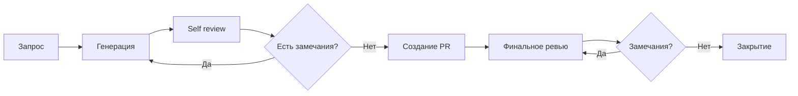
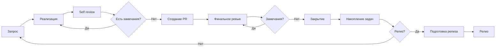

# AI-Assisted Development Playbook

Этот репозиторий содержит конфигурацию и правила, которые используются для AI-разработки проекта [TasK](https://task.ai-aid.pro/). Он служит публичным примером организации документации и рабочих процессов для AI-агентов (в среде Codex CLI, Kilo Code или аналогичных). Здесь собраны правила, ролевые инструкции и шаблоны, которые позволяют эффективно управлять разработкой с помощью LLM.

Я публикую эти материалы как пример реального workflow, чтобы поделиться опытом, обсудить подходы к AI-разработке и вместе найти способы их улучшения. Вы можете свободно изучать, адаптировать и применять эти наработки в своих проектах.

## Мой процесс работы

Я пришёл к подходу, который называю **Task-driven development** — разработка, управляемая задачами как спецификациями.

В этом подходе единица истины — не "общее описание требований", а конкретная задача (или эпик), оформленная по строгому шаблону. Задача выступает спецификацией для исполнения: задаёт цель, границы (scope / out of scope), критерии приёмки, обязательные проверки. При необходимости — требования к тестам (юнит, интеграционные, e2e). Реализация считается готовой только после подтверждения соответствия задаче: прохождения проверок, выполнения тестов и финального ревью. Иначе задача уточняется и цикл повторяется.

**Чем отличается от spec-driven development.** Spec-driven строится вокруг отдельного артефакта спецификации (контракт API, сценарии поведения, формальная модель), относительно которого пишется реализация. В task-driven спецификация "упакована" прямо в задачу: таска = spec. Постановка задач становится центральным элементом процесса, а разработка — процессом доказательства, что код удовлетворяет формулировкам задачи.

## 🧠 Основной манифест (AGENTS.md)

Файл [AGENTS.md](./AGENTS.md) является точкой входа и "конституцией" для AI-агента. Он содержит следующие разделы:
* **Миссия** и приоритет правил.
* **Роль** — выбор специализированной роли перед началом работы.
* **Рефлексия** — оценка сложности задачи, контекста и рисков.
* **Язык** — правила общения и именования.
* **Архитектура проекта** — стек, инфраструктура, структура папок, миграции, модули и слои.
* **Работа с кодом** — Git-flow, ветки, работа с задачами и техдолгом.
* **Tests and Validation** — виды тестов, инструменты и `make check`.
* **Предварительные проверки** — требования перед сдачей задачи.
* **Pull Requests** и **Формат коммитов**.
* **Документирование** и **Что запрещено**.
* **Мини-чеклист (для самопроверки)**.

## 🎭 Роли агентов

В зависимости от задачи, агент принимает на себя одну из специализированных ролей. Описания ролей находятся в `docs/agents/roles/team/`:

* **[Аналитик](docs/agents/roles/team/system_analyst.md)** — анализ требований и декомпозиция.
* **[Архитектор](docs/agents/roles/team/system_architect.md)** — проектирование системы и контроль целостности.
* **[Лид (Team Lead)](docs/agents/roles/team/team_lead.md)** — координация и принятие решений.
* **[Бэкендер](docs/agents/roles/team/backend_developer.md)** — разработка серверной части.
* **[Фронтендер](docs/agents/roles/team/frontend_developer.md)** — разработка клиентской части.
* **[Девопс](docs/agents/roles/team/devops_engineer.md)** — инфраструктура и CI/CD.
* **[Продакт (PO)](docs/agents/roles/team/product_owner.md)** — управление продуктом.
* **[QA (Бэкенд)](docs/agents/roles/team/qa_backend.md) / [QA (Фронтенд)](docs/agents/roles/team/qa_frontend.md)** — тестирование.
* **[Code Reviewer (Бэкенд)](docs/agents/roles/team/code_reviewer_backend.md)** — проверка качества кода.

## 📝 Управление задачами (Todo)

Для постановки задач используется файловая система (File-based Task Management) в директории [`todo/`](./todo/). Это позволяет давать агенту задачи как часть контекста проекта.

* **[Правила работы с задачами](./todo/AGENTS.md)** — инструкция по жизненному циклу задач (создание, выполнение, завершение).
* **[Шаблон задачи](./todo/templates/task.md)** — структура файла для отдельной задачи.
* **[Шаблон эпика](./todo/templates/epic.md)** — структура для крупных фич и историй.

## 🚀 Как это работает

Всё строится на AGENTS.md — файле с правилами и конвенциями проекта. Процесс, шаблоны и правила переходов описаны там — так агент работает предсказуемо и обеспечивается повторяемость результата.

Процессы и документы не окончательные — я постоянно их улучшаю. Цели: повысить качество решений агента и его автономность. Чем больше доверяю агенту, тем меньше моего участия в разработке.

Код руками я уже не пишу — только мелкие правки и md-документы. Но участие всё равно велико: не могу на 100% доверять моделям, приходится проверять. Агент нарушает правила проекта, изоляцию слоёв, именование namespace и классов, пишет лишние тесты.

### Процесс постановки задачи

1. **Запрос.** Делаю запрос к ИИ-агенту. Пример: `Возьми на себя роль аналитика. Мне нужна status page для проекта, сделай эпик для этой задачи.`
2. **Генерация.** Агент подгружает роль, требования к постановке задач, шаблоны — и генерирует текст задачи.
3. **Self review.** Прошу агента проверить себя. Если нужно проработать направление (архитектура, devops, фронт, бэк), прошу взять соответствующую роль.
4. **Доработка.** Если есть замечания — прошу исправить и возвращаемся к шагу 2.
5. **Создание PR.** Если всё хорошо — прошу агента создать PR.
6. **Финальное ревью.** Проверяю постановку задачи сам, прохожу с агентом итерации "замечание — правка".
7. **Закрытие.** Мержу PR, сообщаю агенту. Он удаляет ветку, переключается на master, выбирает следующую задачу и предлагает приступить.

### Процесс реализации задачи

Процесс похож на постановку задачи, но агент проводит больше проверок самостоятельно — прежде чем показать мне код.

1. **Запрос.** Пример: `Ты [Бэкендер](docs/agents/roles/team/backend_developer.md). Возьми в работу задачу из todo/EPIC-status-page.todo.md`
2. **Реализация.** Агент выполняет требования задачи и сам запускает проверки: тесты (PHPUnit), статический анализ (PHPMD, Deptrac, Psalm), валидацию стиля (PHP_CodeSniffer), сборку (Composer). Так создаётся цикл самовалидации — агент отдаёт код уже достаточно чистым.
3. **Self review.** Прошу агента проверить решение. Можно попросить взять роль (архитектура, devops, фронт, бэк) и прогнать проверки последовательно.
4. **Доработка.** Если есть замечания — прошу исправить и возвращаемся к шагу 2.
5. **Создание PR.** Если всё хорошо — прошу агента создать PR.
6. **Финальное ревью.** Проверяю код сам, прохожу с агентом итерации "замечание — правка".
7. **Закрытие.** Мержу PR, сообщаю агенту. Он удаляет ветку, переключается на master, выбирает следующую задачу.
8. **Накопление задач.** Так накапливается пул задач к релизу.
9. **Подготовка релиза.** Прошу агента запустить e2e-тесты и подготовить релиз: тег, changelog, публикация на GitHub.
10. **Релиз.** Выкладываю в прод: конфигурации, зависимости, миграции, перезапуск супервизора. Затем — post-проверки.

## 📂 Примеры реализации

Чтобы лучше понять, как работают эти правила на практике, вы можете изучить реальные артефакты, созданные AI-агентами:

*   **[Пример Эпика](./todo/EPIC-status-page.todo.md)** — полноценная спецификация крупной фичи (Status Page), созданная агентом в роли Аналитика.
*   **Задачи (Tasks)** — в папках [`todo/`](./todo/) и [`todo/done/`](./todo/done/) находятся файлы конкретных задач, на которые был декомпозирован этот эпик.
*   **Примеры кода** — реализация логики проверки здоровья системы, написанная агентом по этим задачам:
    *   [Backend (Symfony)](./src/Module/Health) — доменная логика и инфраструктурные проверки.
    *   [Frontend (Angular)](./apps/web/src/Module/Health) — UI-компоненты и интеграция с API.

### 📸 Пример работы со скриншотами

[В моём блоге](https://prikotov.pro/blog/pervyi-opyt-s-glm-5-koding-cherez-kilo-code#primer-raboty-v-kilo-code) — подробный разбор реальной сессии с ИИ-агентом со скриншотами: от запроса до готового PR. Показываю, как агент работает с этим playbook на практике.

---
> **Примечание:** Этот документ составлен с помощью Gemini CLI (gemini-3-pro-preview) на основе материалов и инструкций, предоставленных автором (человеком).
