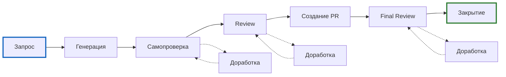
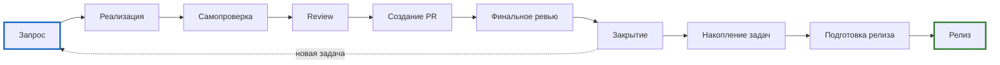
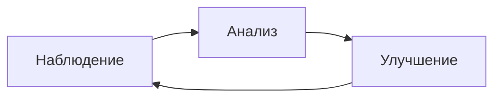

# AI-Assisted Development Playbook

[](README.en.md)
[](README.zh.md)

Этот репозиторий содержит конфигурацию и правила, которые используются для AI-разработки проекта [TasK](https://task.ai-aid.pro/). Он служит публичным примером организации документации и рабочих процессов для AI-агентов (в среде Codex CLI, Kilo Code или аналогичных). Здесь собраны правила, ролевые инструкции и шаблоны, которые позволяют эффективно управлять разработкой с помощью LLM.

Я публикую эти материалы как пример реального workflow, чтобы поделиться опытом, обсудить подходы к AI-разработке и вместе найти способы их улучшения. Вы можете свободно изучать, адаптировать и применять эти наработки в своих проектах.

## Процесс работы

Я пришёл к подходу, который называю **Task-driven development** — разработка, управляемая задачами как спецификациями.

В этом подходе единица истины — не "общее описание требований", а конкретная задача (или эпик), оформленная по строгому шаблону. Задача выступает спецификацией для исполнения: задаёт цель, границы (scope / out of scope), критерии приёмки, обязательные проверки. При необходимости — требования к тестам (юнит, интеграционные, e2e). Реализация считается готовой только после подтверждения соответствия задаче: прохождения проверок, выполнения тестов и финального ревью. Иначе задача уточняется и цикл повторяется.

**Чем отличается от spec-driven development.** Spec-driven строится вокруг отдельного артефакта спецификации (контракт API, сценарии поведения, формальная модель), относительно которого пишется реализация. В task-driven спецификация "упакована" прямо в задачу: таска = spec. Постановка задач становится центральным элементом процесса, а разработка — процессом доказательства, что код удовлетворяет формулировкам задачи.

## 🧠 Основной манифест (AGENTS.md)

Файл [AGENTS.md](./AGENTS.md) является точкой входа и "конституцией" для AI-агента. Он содержит следующие разделы:
* **Миссия** и приоритет правил.
* **Роль** — выбор специализированной роли перед началом работы.
* **Рефлексия** — оценка сложности задачи, контекста и рисков.
* **Язык** — правила общения и именования.
* **Архитектура проекта** — стек, инфраструктура, структура папок, миграции, модули и слои.
* **Работа с кодом** — Git-flow, ветки, работа с задачами и техдолгом.
* **Tests and Validation** — виды тестов, инструменты и `make check`.
* **Предварительные проверки** — требования перед сдачей задачи.
* **Pull Requests** и **Формат коммитов**.
* **Документирование** и **Что запрещено**.
* **Мини-чеклист (для самопроверки)**.

## 🎭 Роли агентов

В зависимости от задачи, агент принимает на себя одну из специализированных ролей. Описания ролей находятся в `docs/agents/roles/team/`:

* **[Продакт](docs/agents/roles/team/product_owner.md)** — управление продуктом.
* **[Аналитик](docs/agents/roles/team/system_analyst.md)** — анализ требований и декомпозиция.
* **[Архитектор](docs/agents/roles/team/system_architect.md)** — проектирование системы и контроль целостности.
* **[Лид](docs/agents/roles/team/team_lead.md)** — координация и принятие решений.
* **[Бэкендер](docs/agents/roles/team/backend_developer.md)** — разработка серверной части.
* **[UI/UX Дизайнер](docs/agents/roles/team/ui_ux_designer.md)** — проектирование пользовательского опыта и интерфейсов.
* **[Фронтендер](docs/agents/roles/team/frontend_developer.md)** — разработка клиентской части.
* **[Девопс](docs/agents/roles/team/devops_engineer.md)** — инфраструктура и CI/CD.
* **[Ревьювер Бэка](docs/agents/roles/team/code_reviewer_backend.md)** — проверка качества кода.
* **[Ревьювер Фронта](docs/agents/roles/team/code_reviewer_frontend.md)** — проверка UI/UX и качества кода.
* **[Ревьювер Девопс](docs/agents/roles/team/code_reviewer_devops.md)** — аудит инфраструктуры и безопасности.
* **[Тестировщик Бэка](docs/agents/roles/team/qa_backend.md)** — тестирование серверной части.
* **[Тестировщик Фронта](docs/agents/roles/team/qa_frontend.md)** — тестирование клиентской части.
* **[Технический писатель](docs/agents/roles/team/technical_writer.md)** — документация пользователя.
* **[Копирайтер](docs/agents/roles/team/copywriter.md)** — контент-маркетинг и сторителлинг.

**Примеры обращения к ролям в запросе:**
* `Бэкендер возьми в работу задачу из todo/EPIC-status-page.todo.md`
* `Девопс посмотри правки в devops/nginx/conf.d/dev/task.conf, всё ли нам там нужно? не переусложняем?`
* `Фронтендер сделай ревью файлу apps/web/assets/controllers/notification-toast_controller.js`

## 📝 Управление задачами (Todo)

Для постановки задач используется файловая система (File-based Task Management) в директории [`todo/`](./todo/). Это позволяет давать агенту задачи как часть контекста проекта.

* **[Правила работы с задачами](./todo/AGENTS.md)** — инструкция по жизненному циклу задач (создание, выполнение, завершение).
* **[Шаблон задачи](./todo/templates/task.md)** — структура файла для отдельной задачи.
* **[Шаблон эпика](./todo/templates/epic.md)** — структура для крупных фич и историй.


## 🚀 Как это работает

Всё строится на AGENTS.md — файле с правилами и конвенциями проекта. Процесс, шаблоны и правила переходов описаны там — так агент работает предсказуемо и обеспечивается повторяемость результата.

Процессы и документы не окончательные — я постоянно их улучшаю. Цели: повысить качество решений агента и его автономность. Чем больше доверяю агенту, тем меньше моего участия в разработке.

Код руками я уже не пишу — только мелкие правки и md-документы. Но участие всё равно велико: не могу на 100% доверять моделям, приходится проверять. Агент нарушает правила проекта, изоляцию слоёв, именование namespace и классов, пишет лишние тесты.

### Процесс постановки задачи

Обычно работа начинается с постановки задачи или эпика. Код идёт следующим шагом.

Пример запроса:

```
Возьми на себя роль аналитика. Мне нужна status page для проекта. Сделай эпик для этой задачи.
```

Дальше процесс такой:

1. **Запрос.** Я задаю роль и цель.
2. **Генерация.** Агент загружает роль, правила постановки задач, шаблоны и пишет эпик.
3. **Самопроверка.** Прошу агента перепроверить себя и исправить слабые места.
4. **Review.** Прошу другую роль проверить задачу: архитектора, ревьювера, QA, девопса.
5. **Создание PR.** Агент оформляет изменения отдельной веткой и PR.
6. **Final Review.** Я сам читаю постановку и даю замечания.
7. **Закрытие.** Агент мержит PR, удаляет ветку, возвращается на master и ждёт следующую команду.


```mermaid
flowchart LR
    A["Запрос"] --> B["Генерация"]
    B --> C["Самопроверка"]

    C --> D["Review"]
    C -.-> C1["Доработка"]
    C1 -.-> C

    D --> E["Создание PR"]
    D -.-> D1["Доработка"]
    D1 -.-> D

    E --> F["Final Review"]

    F --> G["Закрытие"]
    F -.-> F1["Доработка"]
    F1 -.-> F

    classDef start stroke:#1565c0,stroke-width:3px;
    classDef finish stroke:#2e7d32,stroke-width:3px;

    class A start;
    class G finish;
```

> *«Лучше один день потерять, чтобы потом за пять минут долететь»*<br/>
> *— народная мудрость*

Плохая постановка задачи почти гарантирует плохое решение. Хорошая постановка не гарантирует идеальное решение, но уменьшает цикл «проверка → правка» на финальном ревью.

### Процесс реализации задачи

Реализация похожа на планирование, только вместо текста задачи агент меняет код.

Пример запроса:

```
Бэкендер, возьми в работу задачу из todo/EPIC-status-page.todo.md.
```

Дальше:

1. **Запрос.** Даю роль и файл задачи.
2. **Реализация.** Агент пишет код, тесты, миграции, документацию.
3. **Проверки.** Запускает PHPUnit, PHPCS, Psalm, Deptrac, PHPMD, Composer или `make check`.
4. **Самопроверка.** Сам проверяет своё решение.
5. **Role review.** Другая роль смотрит архитектуру, тесты, UX или инфраструктуру.
6. **PR.** Агент создаёт pull request.
7. **Финальное ревью.** Я читаю результат и прохожу с агентом цикл «замечание → правка».
8. **Merge.** Агент мержит, удаляет ветку, возвращается на master.
9. **Релиз.** Перед релизом агент запускает e2e, готовит changelog и тег. Прод выкладываю сам.


```mermaid
flowchart LR
    A["Запрос"] --> B["Реализация"]
    B --> C["Самопроверка"]
    C --> D["Review"]
    D --> E["Создание PR"]
    E --> F["Финальное ревью"]
    F --> G["Закрытие"]

    G -.->|"новая задача"| A

    G --> H["Накопление задач"]
    H --> I["Подготовка релиза"]
    I --> J["Релиз"]

    classDef start stroke:#1565c0,stroke-width:3px;
    classDef release stroke:#2e7d32,stroke-width:3px;

    class A start;
    class J release;
```

Ценность такого процесса — в разделении этапов. Агент не делает всё одним прыжком: сначала реализует, потом проверяет себя, потом отдаёт результат другой роли и только потом передает человеку на финальное ревью. Такое разделение этапов в купе с предварительным планированием задачи повышает качество реализации и уменьшает время потраченное человеком на финальном ревью.

### Финальное ревью

На финальном ревью я смотрю не столько саму реализацию, сколько соответствие кода правилам проекта: конвенциям, изоляции модулей, принципу `High cohesion, low coupling`, предметным границам и единому языку предметной области.

Ещё проверяю то, что пока не перенесено в детерминированные инструменты: странные решения, лишнюю сложность, нарушения безопасности и явную дичь. Если что-то кажется неправильным, обычно спрашиваю агента, почему он сделал именно так. Дальше либо соглашаюсь, либо агент переделывает.

Код тестов почти не смотрю: открываю редко, когда нужно проверить конкретный сценарий или причину падения.

Отдельно проверяю оформление PR. Например, мне важно, чтобы агент ставил на PR свою метку: по этим меткам потом строятся отчёты по доле работы агентов.

Правки в правилах для агентов читаю внимательнее обычного кода. Хорошее правило даёт большую отдачу, но агенты не всегда хорошо пишут правила для самих себя: часто получается многословно и не по сути. Думаю, это можно улучшить, если потратить время и научить агентов писать такие правила лучше. Пока такие правки я предпочитаю вычитывать руками.

На финальном ревью я также фиксирую повторяющиеся ошибки агентов. Потом из них рождаются новые правила, проверки и уточнения процесса.

### Процесс непрерывных улучшений (Ретроспектива)

Этот процесс направлен на постоянное повышение автономности и качества работы агента. Он замыкает цикл разработки, трансформируя выявленные проблемы в обновленные стандарты и автоматические проверки.

1. **Наблюдение.** Мониторинг работы агента в реальном времени. Фиксируем любые заминки, недопонимания контекста или ошибки, всплывающие на этапе ревью.
2. **Анализ.** Выделяем повторяющиеся паттерны ошибок, которые тратят ресурсы (время, токены). Ищем системное решение: как изменить инструкцию или инструмент, чтобы ошибка не повторилась.
3. **Улучшение.** Вносим точечные правки в `AGENTS.md`, шаблоны задач или конфиги линтеров. Обновляем базу знаний проекта.


```mermaid
flowchart LR
    A[Наблюдение] --> B[Анализ]
    B --> C[Улучшение]
    C --> A
```

> **Важно:** Соблюдайте принцип изолированных изменений. Не меняйте всё сразу — так невозможно отследить влияние конкретной правки. Внедряйте улучшения малыми порциями и сразу проверяйте эффект.

## 📂 Примеры реализации

Чтобы лучше понять, как работают эти правила на практике, вы можете изучить реальные артефакты, созданные AI-агентами:

*   **[Пример Эпика](./todo/EPIC-status-page.todo.md)** — полноценная спецификация крупной фичи (Status Page), созданная агентом в роли Аналитика.
*   **Задачи (Tasks)** — в папках [`todo/`](./todo/) и [`todo/done/`](./todo/done/) находятся файлы конкретных задач, на которые был декомпозирован этот эпик.
*   **Примеры кода** — реализация логики, написанная агентом по этим задачам:
    *   [Core](./src/Module/Health) — логика, сервисы и интеграции.
    *   [Web](./apps/web/src/Module/Health) — контроллеры и шаблоны страниц.
*   **Примеры тестов** — тесты, созданные агентом для проверки реализации:
    *   [Core Tests](./tests) — unit и integration тесты.
    *   [Web Tests](./apps/web/tests) — unit и e2e тесты.

### 📸 Пример работы со скриншотами

[В моём блоге](https://prikotov.pro/blog/pervyi-opyt-s-glm-5-koding-cherez-kilo-code#primer-raboty-v-kilo-code) — подробный разбор реальной сессии с ИИ-агентом со скриншотами: от запроса до готового PR. Показываю, как агент работает с этим playbook на практике.

---

## 📦 Практическая реализация (май 2026)

Методология этого руководства реализована в виде набора Composer-пакетов — каждый инструментально воплощает отдельный элемент подхода (конвенции, задачи, роли, git-процесс). На их основе собран готовый к использованию каркас проекта:

**[prikotov/symfony-ddd-ai-skeleton](https://github.com/prikotov/symfony-ddd-ai-skeleton)** — повторно используемый каркас на Symfony 8 / PHP 8.4 с модульным DDD/CQRS, ядром для нескольких приложений, адаптированным под работу с ИИ-агентами рабочим процессом (`AGENTS.md`, роли, конвенции, todo-md) и встроенным автоматическим контролем качества (`make check`). Подходит как отправная точка для проектов со сложной предметной областью, где модульная архитектура и DDD помогают управлять сложностью.

Сопутствующие пакеты, реализующие отдельные элементы подхода:

| Пакет | Назначение |
|-------|------------|
| [prikotov/coding-standard](https://github.com/prikotov/coding-standard) | Конвенции — стандарты кодирования, описывающие принципы, паттерны, слои, модули и структуру Symfony-приложения. Автоматические проверки (PHPCS, Deptrac, PHPStan) контролируют следование конвенциям |
| [prikotov/todo-md](https://github.com/prikotov/todo-md) | Система управления задачами: задачи хранятся как markdown-файлы с YAML front matter, статусы меняются перемещением между папками, шаблоны и справочники помогают AI-агентам ставить и вести задачи |
| [prikotov/task-orchestrator](https://github.com/prikotov/task-orchestrator) | Оркестратор консольных агентов: роли с поведенческими профилями (DISC, Big Five), навыки, дочерние агенты в изолированном контексте, цепочки шагов в YAML, проверка ролей |
| [prikotov/git-workflow](https://github.com/prikotov/git-workflow) | Правила работы с Git: именование веток, формат коммитов (Conventional Commits), порядок проведения запросов на слияние, рецензирования кода, выпуска релизов, развёртывания и защиты секретов |

Подробнее о том, как и почему я пришёл к этому подходу — в статье: [«AI-агенты для программирования: как я подготовил проект»](https://prikotov.pro/blog/ii-agenty-dlya-programmirovaniya-kak-ya-podgotovil-proekt).

---
