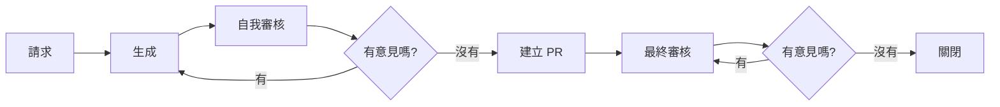
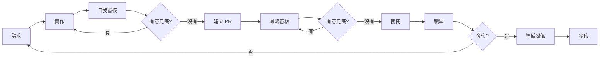
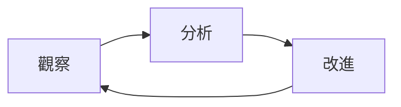

# AI 輔助開發攻略 (AI-Assisted Development Playbook)

> **注意：** 此翻譯由 Gemini CLI (gemini-3-flash-preview) 完成。

此儲存庫包含了用於 [TasK](https://task.ai-aid.pro/) 專案 AI 輔助開發的配置與規則。它作為一個公開範例，展示了如何為 AI 代理（在 Gemini CLI、Codex CLI、Kilo Code 或類似環境中）組織文件與工作流程。在這裡，您將找到能夠使用 LLM 進行有效開發管理的規則、角色指令與模板。

我發佈這些材料是作為一個真實工作流程的範例，旨在分享我的經驗，討論 AI 開發方法，並共同尋找改進之道。您可以自由地學習、改編並將這些實踐應用於您自己的專案中。

## 工作流程 (Workflow)

我得出了一個我稱之為 **任務驅動開發 (Task-driven development)** 的方法 —— 即以任務作為規範（Specification）來驅動開發。

在這種方法中，真理的單位不是「一般的需求描述」，而是按照嚴格模板格式化的特定任務（或史詩任務）。任務作為執行的規範：它定義了目標、邊界（範圍內/範圍外）、驗收標準與強制性檢查。如有必要，它還包含對測試（單元測試、集成測試、e2e 測試）的需求。只有在確認符合任務要求後（通過檢查、執行測試並完成最終審核），實作才被視為完成。否則，將精煉任務並重複循環。

**與規範驅動開發 (Spec-driven development) 的區別：** 規範驅動開發是圍繞著一個獨立的規範產出物（API 合約、行為場景、正式模型）來編寫實作。在任務驅動開發中，規範被直接「包裝」在任務中：任務 = 規範。任務設定成為流程的核心元素，而開發則成為證明程式碼滿足任務表述的過程。

## 🧠 核心宣言 (AGENTS.md)

[AGENTS.md](./AGENTS.en.md) 檔案是 AI 代理的入口點與「憲法」。它包含以下章節：
* **使命 (Mission)** 與規則優先級。
* **角色 (Role)** —— 在開始工作前選擇一個專業角色。
* **反思 (Reflection)** —— 評估任務複雜度、上下文與風險。
- **語言 (Language)** —— 溝通與命名規則。
* **專案架構 (Project Architecture)** —— 技術棧、基礎設施、資料夾結構、遷移、模組與層次。
* **程式碼協作 (Working with Code)** —— Git 工作流、分支、任務管理與技術債。
* **測試與驗證 (Tests and Validation)** —— 測試類型、工具與 `make check`。
* **預先檢查 (Pre-checks)** —— 提交任務前的要求。
* **拉取請求 (Pull Requests)** 與 **提交格式 (Commit Format)**。
* **文件化 (Documentation)** 與 **禁止事項 (Prohibitions)**。
* **迷你檢查清單 (Mini-checklist)** —— 用於自我檢查。

## 🎭 代理角色 (Agent Roles)

根據任務的不同，代理會承擔其中一個專業角色。角色描述位於 `docs/agents/roles/team/`（文件目前為俄文/英文）：

* **[產品負責人 (PO)](docs/agents/roles/team/product_owner.en.md)** —— 產品管理。
* **[分析師 (Analyst)](docs/agents/roles/team/system_analyst.en.md)** —— 需求分析與分解。
* **[架構師 (Architect)](docs/agents/roles/team/system_architect.en.md)** —— 系統設計與完整性控制。
* **[組長 (Lead)](docs/agents/roles/team/team_lead.en.md)** —— 協調與決策。
* **[後端開發者 (Backend Developer)](docs/agents/roles/team/backend_developer.en.md)** —— 伺服器端開發。
* **[UI/UX 設計師 (UI/UX Designer)](docs/agents/roles/team/ui_ux_designer.en.md)** —— 使用者體驗與介面設計。
* **[前端開發者 (Frontend Developer)](docs/agents/roles/team/frontend_developer.en.md)** —— 客戶端開發。
* **[DevOps](docs/agents/roles/team/devops_engineer.en.md)** —— 基礎設施與 CI/CD。
* **[後端審核者 (Backend Reviewer)](docs/agents/roles/team/code_reviewer_backend.en.md)** —— 程式碼品質檢查。
* **[前端審核者 (Frontend Reviewer)](docs/agents/roles/team/code_reviewer_frontend.en.md)** —— UI/UX 與 程式碼品質檢查。
* **[DevOps 審核者 (DevOps Reviewer)](docs/agents/roles/team/code_reviewer_devops.en.md)** —— 基礎設施與安全性審核。
* **[後端 QA (Backend QA)](docs/agents/roles/team/qa_backend.en.md)** —— 伺服器端測試。
* **[前端 QA (Frontend QA)](docs/agents/roles/team/qa_frontend.en.md)** —— 客戶端測試。
* **[技術作家 (Technical Writer)](docs/agents/roles/team/technical_writer.en.md)** —— 使用者文件與說明。
* **[文案策劃 (Copywriter)](docs/agents/roles/team/copywriter.en.md)** —— 內容行銷與故事講述。

**在請求中指定角色的範例：**
* `Backend Developer take the task from todo/EPIC-status-page.todo.md to work`
* `DevOps check the changes in devops/nginx/conf.d/dev/task.conf, do we need everything there? Are we overcomplicating it?`
* `Frontend Developer review the file apps/web/assets/controllers/notification-toast_controller.js`

## 📝 任務管理 (Todo)

使用 `todo/` 目錄中的基於檔案的任務管理系統 (File-based Task Management) 來設定任務。這允許代理將任務作為專案上下文的一部分來接收。

* **[任務規則 (Task Rules)](./todo/AGENTS.md)** —— 關於任務生命週期（建立、執行、完成）的說明。
* **[任務模板 (Task Template)](./todo/templates/task.md)** —— 單個任務的檔案結構。
* **[史詩模板 (Epic Template)](./todo/templates/epic.md)** —— 大型功能與故事的結構。

## 🚀 它是如何運行的

一切都建立在 `AGENTS.md` 之上 —— 這是一個包含專案規則與慣例的檔案。流程、模板與轉換規則都在那裡描述，確保代理的工作是可預測的，且結果是可重複的。

這些流程與文件並非最終版本 —— 我一直在不斷改進它們。目標是提高代理解決方案的品質及其自主性。我對代理越信任，我參與開發的程度就越低。

我不再親手編寫程式碼 —— 只進行微小的編輯與編寫 markdown 文件。但我的參與仍然非常重要：我無法 100% 信任模型，我必須進行驗證。代理有時會違反專案規則、層次隔離、命名空間與類別命名，並編寫冗餘測試。

### 任務設定流程

1. **請求 (Request)。** 我向 AI 代理提出請求。範例：`Take on the role of an analyst. I need a status page for the project, create an epic for this task.`
2. **生成 (Generation)。** 代理載入角色、任務設定要求與模板 —— 並生成任務文本。
3. **自我審核 (Self-review)。** 我要求代理自我檢查。如果特定方向（架構、devops、前端/後端開發者）需要加強，我會要求它承擔相應的角色。
4. **精煉 (Refinement)。** 如果有意見，我會要求修正，然後回到第 2 步。
5. **建立 PR (PR Creation)。** 如果一切正常，我會要求代理建立 PR。
6. **最終審核 (Final Review)。** 我親自檢查任務設定，與代理一起進行「意見 —— 修正」的迭代。
7. **關閉 (Closing)。** 我合併 PR 並通知代理。它刪除分支，切換到 master，選擇下一個任務並提議開始。

### 任務實作流程

流程與任務設定類似，但代理在向我展示程式碼之前會獨立執行更多檢查。

1. **請求 (Request)。** 範例：`You are a [Backend Developer](docs/agents/roles/team/backend_developer.en.md). Take the task todo/EPIC-status-page.todo.md to work.`
2. **實作 (Implementation)。** 代理履行任務需求並自行執行檢查：測試 (PHPUnit)、靜態分析 (PHPMD, Deptrac, Psalm)、風格驗證 (PHP_CodeSniffer)、構建 (Composer)。這建立了一個自我驗證循環 —— 代理交付的程式碼已經足夠乾淨。
3. **自我審核 (Self-review)。** 我要求代理檢查解決方案。我可以要求它承擔特定角色（架構師、devops、前端/後端開發者）並依序執行檢查。
4. **精煉 (Refinement)。** 如果有意見，我會要求修正，然後回到第 2 步。
5. **建立 PR (PR Creation)。** 如果一切正常，我會要求代理建立 PR。
6. **最終審核 (Final Review)。** 我親自檢查程式碼，與代理一起進行「意見 —— 修正」的迭代。
7. **關閉 (Closing)。** 我合併 PR 並通知代理。它刪除分支，切換到 master，選擇下一個任務。
8. **積累 (Accumulation)。** 任務積累以進行發佈。
9. **發佈準備 (Release Preparation)。** 我要求代理執行 e2e 測試並準備發佈：標籤 (tag)、變更日誌 (changelog)、在 GitHub 上發佈。
10. **發佈 (Release)。** 我將其部署到生產環境 (prod)：配置、依賴項、遷移、重新啟動 supervisor。然後 —— 進行後期檢查。

### 持續改進流程 (回顧 / Retrospective)

此流程旨在持續提高代理的自主性與工作品質。它通過將識別出的問題轉化為更新的標準與自動化檢查，來閉合開發循環。

1. **觀察 (Observation)。** 即時監控代理的工作。記錄在審核階段出現的任何猶豫、上下文誤解或錯誤。
2. **分析 (Analysis)。** 識別浪費資源（時間、token）的重複錯誤模式。尋求系統性解決方案：如何修改指令或工具以防止錯誤再次發生。
3. **改進 (Improvement)。** 對 `AGENTS.md`、任務模板或 linter 配置進行針對性修改。更新專案知識庫。

> **重要：** 堅持隔離變更原則。不要一次改變所有內容 —— 這會導致無法追蹤特定修改的影響。分小批次實施改進並立即驗證效果。

## 📂 實作範例 (Implementation Examples)

為了更好地理解這些規則在實踐中是如何運行的，您可以查看由 AI 代理建立的真實產出物：

*   **[史詩範例 (Epic Example)](./todo/EPIC-status-page.todo.md)** —— 由代理在分析師角色下建立的重大功能（狀態頁面）的完整規範。
*   **任務 (Tasks)** —— `todo/` 與 `todo/done/` 目錄包含此史詩任務分解後的具體任務檔案。
*   **程式碼範例 (Code Examples)** —— 代理根據這些任務編寫的實作邏輯：
    *   [核心 (Core)](./src/Module/Health) —— 邏輯、服務與集成。
    *   [網頁 (Web)](./apps/web/src/Module/Health) —— 控制器與頁面模板。
*   **測試範例 (Test Examples)** —— 代理為驗證實作而建立的測試：
    *   [核心測試 (Core Tests)](./tests) —— 單元測試與集成測試。
    *   [網頁測試 (Web Tests)](./apps/web/tests) —— 單元測試與 e2e 測試。

### 📸 附帶螢幕截圖的範例

[在我的部落格中](https://prikotov.pro/blog/pervyi-opyt-s-glm-5-koding-cherez-kilo-code#primer-raboty-v-kilo-code) —— 一個帶有螢幕截圖的真實 AI 代理會話詳細流程：從請求到完成 PR。展示了代理如何在實踐中與此攻略協作。

---
> **附註：** 此文件由 Gemini CLI (gemini-3-pro-preview) 根據作者（人類）提供的材料與指令編寫。
