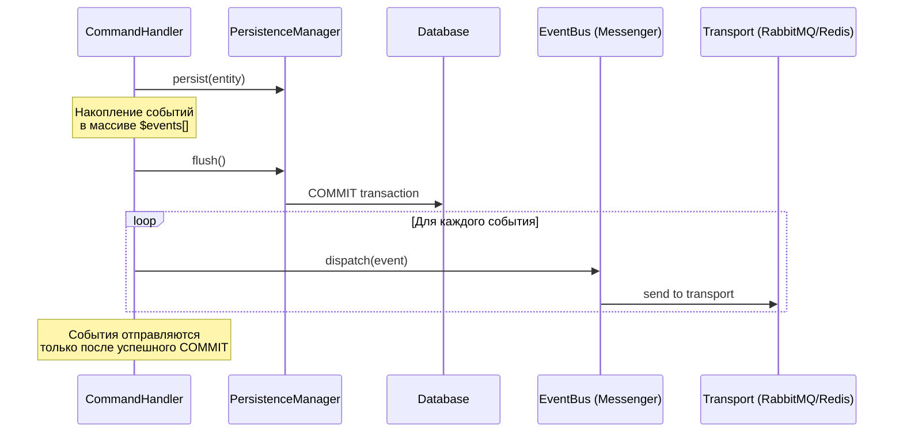
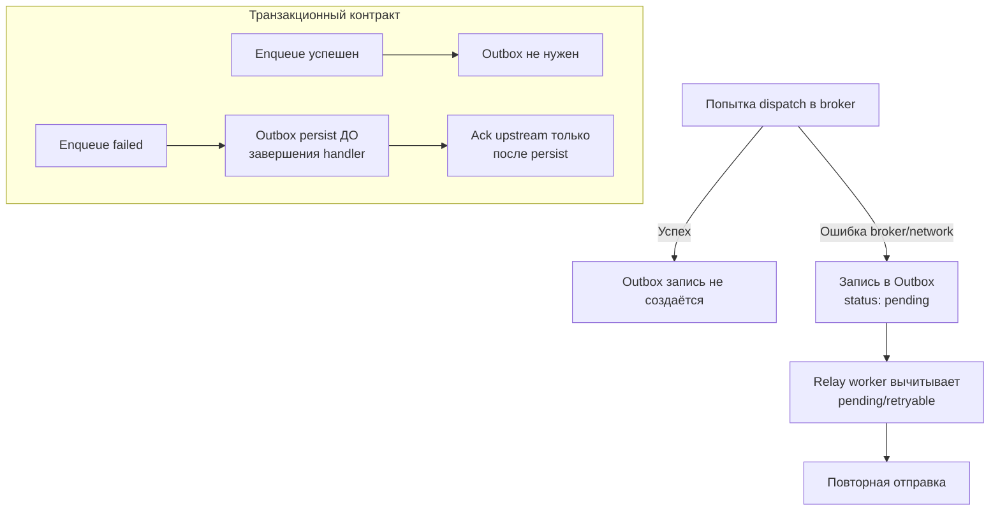

# События и транзакции БД

## Обзор

Документ описывает архитектурное соотношение между доменными событиями (Domain Events) и транзакциями базы данных в проекте TasK.

## Ключевое правило

**События dispatch'ся ПОСЛЕ `flush()`**, когда данные уже записаны в БД.

Данное правило зафиксировано в конвенции: [События (Event) — Порядок dispatch](../../conventions/layers/application/event.md#порядок-dispatch-событий).

### Пример правильной реализации

```php
// ✅ Правильно — события после flush:
$events = [];
foreach ($items as $item) {
    $this->persistenceManager->persist($item);
    if ($condition) {
        $events[] = new ChangedEvent(...);
    }
}
$this->persistenceManager->flush();

// Dispatch events AFTER flush to ensure data is persisted
foreach ($events as $event) {
    $this->eventBus->dispatch($event);
}
```

### Пример неправильной реализации

```php
// ❌ Неправильно — событие внутри транзакции:
foreach ($items as $item) {
    $this->persistenceManager->persist($item);
    if ($condition) {
        $this->eventBus->dispatch(new ChangedEvent(...)); // Данных в БД ещё нет!
    }
}
$this->persistenceManager->flush();
```

## Архитектурная схема



## Обоснование

| Проблема | Решение |
|----------|---------|
| Если dispatch до flush — listener'ы не найдут данные в БД | Данные гарантированно записаны до отправки события |
| Rollback транзакции — слушатели уже получили событие о несуществующих данных | События отправляются только после успешного commit |
| Нарушение консистентности между БД и очередями | Гарантия "сначала данные, потом уведомления" |

## Outbox Pattern (для критичных уведомлений)

Для критически важных уведомлений, где требуется гарантия доставки, используется **Outbox Pattern**.

Подробное описание: [Source Status Live Updates — Транзакционный контракт](../module/source-status-live-updates-worker-web.md#транзакционный-контракт-enqueue---outbox).

### Схема Outbox Pattern



### Когда использовать Outbox

- Критически важные уведомления (например, live-updates статуса)
- Финансовые операции с внешними системами
- Интеграции с внешними API, где потеря события недопустима

### Когда Outbox не нужен

- Обычные доменные события между модулями
- Уведомления с допустимой задержкой
- События, обрабатываемые через retry_strategy Messenger

## Текущая реализация

### Компоненты

| Компонент | Расположение | Описание |
|-----------|--------------|----------|
| EventBusInterface | [`src/Component/Event/EventBusInterface.php`](../../../src/Component/Event/EventBusInterface.php) | Интерфейс шины событий |
| SymfonyMessengerEventBus | [`src/Component/Event/SymfonyMessengerEventBus.php`](../../../src/Component/Event/SymfonyMessengerEventBus.php) | Реализация через Symfony Messenger |
| PersistenceManagerInterface | [`src/Component/Persistence/PersistenceManagerInterface.php`](../../../src/Component/Persistence/PersistenceManagerInterface.php) | Интерфейс для работы с БД |

### Конфигурация Messenger

Файл: [`config/packages/messenger.yaml`](../../../config/packages/messenger.yaml)

```yaml
framework:
  messenger:
    default_bus: event.bus
    buses:
      event.bus:
        default_middleware: allow_no_handlers
        middleware:
          - validation
          - doctrine_ping_connection
```

**Важно:** Middleware `doctrine_transaction` отсутствует — транзакциями управляет код хендлера явно через `flush()`.

### Routing событий

События маршрутизируются по транспортам:

| Событие | Transport | Назначение |
|---------|-----------|------------|
| `SourceEventInterface` | `source_events` | События статуса источника |
| `BroadcastStatusCommand` | `source_status_live_updates` | Live-updates для web |
| `SendCommand` (Email) | `notification_email` | Email-уведомления |

## Резюме

| Аспект | Реализация |
|--------|------------|
| **Порядок** | `flush()` → `dispatch()` |
| **Транзакционность событий** | Нет (eventual consistency) |
| **Outbox pattern** | Опционально для критичных уведомлений |
| **Гарантия доставки** | Через retry_strategy Messenger |
| **Консистентность** | Данные в БД → потом события |

Это классический паттерн **"Post-Commit Event Dispatching"** — простой, надёжный, без overhead Outbox для всех событий.

## Связанные документы

- [Конвенция: События (Event)](../../conventions/layers/application/event.md)
- [Source Status Live Updates Architecture](../module/source-status-live-updates-worker-web.md)
- [Конвенция: Внешние сервисы](../../conventions/core_patterns/external-service.md)
