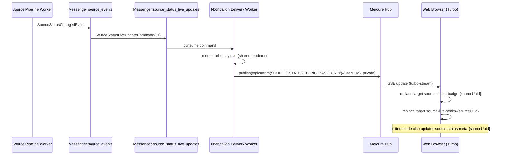

# Source Status Live Updates: архитектура доставки Worker -> Web

## 1. AS-IS проблема

Текущая реализация имеет разрыв для split-node сценария (`worker-cli -> Web UI`):

1. В `apps/console` для `SourceStatusBroadcasterInterface` подключен `NullSourceStatusBroadcaster`.
2. В `apps/console` для `RenderSourceStatusTurboStreamServiceInterface` подключен `NullRenderSourceStatusTurboStreamService`.
3. Shared renderer в `src/Module/Notification` зависит от Twig namespace `@web.notification/*`, который принадлежит `apps/web`.

Итог: на выделенном worker-сервере статусы Source обрабатываются, но live-обновления в UI не доставляются.

## 2. Варианты topology

### Option A: Direct Publish из Worker в Mercure (выбранный вариант)

Поток:

1. `SourceStatusChangedEvent` обрабатывается в worker-контексте (`source_events`).
2. Worker ставит отдельную delivery command в `source_status_live_updates` transport.
3. Delivery handler в worker рендерит Turbo Stream payload через shared renderer (без web-зависимости).
4. Worker публикует update в Mercure с отдельными worker credentials.
5. Браузер получает SSE update и применяет Turbo Stream replace для badge target.

Плюсы:

- Минимальная задержка и меньше hop’ов.
- Нет runtime-зависимости от web-node в publish path.
- Событие и доставка остаются в одном worker-контуре.
- Соответствует цели Phase 2 (`worker -> Mercure`).

Минусы:

- Worker должен иметь безопасный доступ к Mercure.
- Нужно убрать зависимость renderer от `@web.notification`.
- Нужен явный слой idempotency/ordering в delivery.

### Option B: Relay через web-side consumer

Поток:

1. Worker публикует нормализованное delivery message в broker.
2. Web-side consumer читает message, рендерит payload в web-контексте и публикует в Mercure.

Плюсы:

- Можно переиспользовать текущий web Twig stack.
- Mercure publisher credentials остаются на web-стороне.

Минусы:

- Дополнительный hop/consumer и выше операционная сложность.
- Доставка зависит от отдельного web-consumer runtime.
- Отдаляет закрытие worker auth/security задачи.

## 3. Topology Decision

Выбран вариант: **Option A (Direct Publish из Worker в Mercure)**.

Основания:

1. Прямое соответствие цели remediation для split web/worker deployment.
2. Минимальный end-to-end путь и latency.
3. Возможность независимого rollout через feature flag и отдельный transport.
4. Устранение зависимости `src/Module/* -> apps/web/*` в production path.

## 4. Контракты и точки интеграции

## Worker (Source -> Notification)

Вход:

- `SourceStatusChangedEvent` (`Source` module, transport `source_events`).

Новая delivery command:

- `SourceStatusLiveUpdateCommand` (имя финализируется на этапе implementation task).
- Routing в отдельный Messenger transport: `source_status_live_updates`.
- Обязательное правило routing:
  `Common\Module\Notification\Application\UseCase\Command\Source\LiveUpdate\SourceStatusLiveUpdateCommand`
  -> `source_status_live_updates`.
- Обязательный dispatch path: `AsyncCommandBusComponentInterface` -> `command.bus` (не `CommandBusComponentInterface`),
  чтобы сохранялась совместимость с `BuildVersionMiddleware`/`BuildVersionGuardMiddleware`.
- Текущий sync listener (`BroadcastOnSourceStatusChangedListener`) должен быть переведен на async dispatch path.

Fail-safe на границе enqueue (обязательный):

1. Попытка dispatch в `source_status_live_updates`.
2. При ошибке dispatch (broker/network/transport) событие **не** должно ронять `source_events` pipeline.
3. Fallback: запись события в `SourceStatusLiveUpdateOutbox` (persistent store) со статусом `pending`.
4. Отдельный relay worker/command вычитывает outbox и повторно публикует в `source_status_live_updates`.
5. При исчерпании policy событие переводится в `dropped` с диагностикой.

Транзакционный контракт enqueue -> outbox:

1. Если enqueue в broker успешен, outbox запись не создается.
2. Если enqueue завершился ошибкой, outbox запись `pending` должна быть зафиксирована до завершения handler.
3. Ack/commit upstream обработки допускается только после успешного persist outbox fallback.
4. При невозможности persist outbox событие переводится в hard-failure path (`failed` transport) с диагностикой.

Обязательные поля (`schemaVersion: 1`):

- `eventId` (UUID v7),
- `occurredAt` (UTC timestamp),
- `sourceUuid`,
- `recipientUuid`,
- `status`,
- `statusChangedAt`,
- `lastErrorAt`,
- `lastErrorMessage`,
- `deliveryAttempt`.

Источник истины для `deliveryAttempt`:

1. Для первого enqueue: `deliveryAttempt = 1`.
2. Для relay/retry: `deliveryAttempt = outbox.attempt_count + 1`.
3. Если transport дает `RedeliveryStamp`, его значение используется как дополнительный diagnostic field,
   но бизнес-источник истины остается `outbox.attempt_count`.

## Notification Delivery -> Mercure

Topic contract:

- Каноничное runtime-значение:
  `rtrim(SOURCE_STATUS_TOPIC_BASE_URI, '/') . '/' . {userUuid}`.
- Семантический alias в документации: `source-status/{userUuid}` (только читаемое обозначение).
- Фактический publish/subscribe выполняется через `SourceStatusTopicFactory`.
- Для auth/ACL/JWT claims используется **только** каноничное runtime-значение.

Payload contract:

- Turbo Stream payload остается совместимым с текущим frontend behavior.
- Основной target: `source-status-badge-{sourceUuid}`.
- Обязательный degradation target (V2): `source-live-health-{sourceUuid}`.
- Legacy degradation target (compat period): `source-status-meta-{sourceUuid}`.

Политика эмиссии Turbo Streams:

1. Всегда отправляется stream для badge (`source-status-badge-{sourceUuid}`).
2. Stream для degradation UX отправляется отдельным действием после badge stream.
3. Во время migration периода (`source_status_live_degradation_ui=limited`) отправляются оба degradation target:
   - `source-live-health-{sourceUuid}` (новый),
   - `source-status-meta-{sourceUuid}` (legacy compatibility).
4. После migration периода (`source_status_live_degradation_ui=on`) отправляется только новый degradation target
   `source-live-health-{sourceUuid}`.
5. Если конкретный target отсутствует в DOM, update считается допустимым no-op и не влияет на badge update.
6. В режиме `source_status_live_degradation_ui=off` деградационный stream не отправляется, остается только badge stream.

Renderer TO-BE (обязательная детализация):

1. Основной шаблон live-update переносится в shared namespace `src/Module/Notification/Resource/templates/...`.
2. `RenderSourceStatusTurboStreamService` не должен зависеть от `@web.notification/*` и `Web\*` Twig components.
3. Формирование badge HTML выполняется в shared renderer через стабильный mapping
   `status -> css variant/text/title` (без web-only компонента `twig:Source:StatusBadge`).
4. Web-приложение использует тот же DOM target protocol, но не является runtime-зависимостью для worker-side rendering.

Точный визуальный контракт badge (must match current UI):

| Status | Badge type | Badge text | Title |
| :--- | :--- | :--- | :--- |
| `new` | `primary` | `new` | `null` |
| `needDownload` | `info` | `processing` | `needDownload` |
| `needExtract` | `info` | `processing` | `needExtract` |
| `processing` | `info` | `processing` | `null` |
| `diarize` | `info` | `processing` | `diarize` |
| `transcribe` | `info` | `processing` | `transcribe` |
| `makeDocument` | `info` | `processing` | `makeDocument` |
| `makeChunks` | `info` | `processing` | `makeChunks` |
| `active` | `success` | `active` | `null` |
| `error` | `warning` | `error` | `null` |
| `deleted` | `danger` | `deleted` | `null` |

## Web UI

Подписка:

- Сохраняется текущая схема `TurboStreamTopicRegistry` + `<turbo-stream-source ... withCredentials: true>`.

Ограничения совместимости:

- Не ломать текущий topic registration flow в `MercureAuthorizationSubscriber`.
- Сохранить существующий DOM target naming protocol.

Контракт деградационного UX (обязателен для 4 контекстов):

1. Каждый контекст рендерит контейнер `source-live-health-{sourceUuid}`.
2. Контейнер должен отображать:
   - stale marker,
   - `last updated` timestamp,
   - degraded message.
3. Контексты (must):
   - `source view`,
   - `source list`,
   - `project view`,
   - `chat sources`.
4. До полного rollout допускается dual-target поддержка (`source-live-health-*` + legacy `source-status-meta-*`).

## 5. Sequence Diagram

## 6. Idempotency & Ordering

Правила delivery handler:

1. Ordering key: `(recipientUuid, sourceUuid)`.
2. Freshness comparator:
   - `statusChangedAt` (primary),
   - `occurredAt` (secondary),
   - `eventId` (tertiary tie-breaker).
3. Stale/duplicate events (older/equal checkpoint) игнорируются.
4. Checkpoint store: shared cache (Memcached/Redis) с TTL >= `max staleness`.
5. Повторная доставка того же `eventId` не должна откатывать UI назад.

## 7. Security Model

Требования к worker publisher auth:

1. Отдельные worker publisher credentials (не subscriber/browser credentials).
2. Least privilege Mercure claims:
   - publish только в source-status topic scope,
   - без wildcard publish для сторонних каналов.
3. Secret handling:
   - env-injected secrets по нодам,
   - документированная rotation (dual-key window + restart order),
   - запрет секретов в логах.
4. Transport security:
   - TLS verification для worker -> Mercure обязательна,
   - зафиксированная CA trust policy для private/self-signed certs.
5. Network boundary:
   - publish endpoint доступен только из trusted private network,
   - firewall/ACL allowlist на worker nodes,
   - публичный ingress publish-path запрещен.

Mercure topology для split-node (обязательная):

1. Public subscribe endpoint (browser only):
   - `MERCURE_PUBLIC_URL=https://<public-host>/.well-known/mercure`.
2. Private publish endpoint (backend/worker only):
   - `MERCURE_URL=http://<mercure-internal-host>/.well-known/mercure`
     или `https://<mercure-internal-host>/.well-known/mercure`.
3. Nginx/internal proxy route для publish:
   - доступ ограничен private CIDR/VPN/SG allowlist,
   - deny для внешнего трафика,
   - TLS verification обязательна при HTTPS.
4. JWT claims для publisher:
   - publish scope ограничен `rtrim(SOURCE_STATUS_TOPIC_BASE_URI, '/') . '/' . *`
     (или более узкий per-tenant policy, если поддерживается).

## 8. Non-blocking Degradation

Source pipeline не должен останавливаться при недоступности Mercure.

Политика:

1. Бизнес-обработка Source завершается независимо от результата live-delivery.
2. Ошибки доставки изолируются в `source_status_live_updates` path.
3. Ошибки enqueue не пробрасываются в upstream handler: применяется fallback в outbox.
4. При исчерпании retry budget событие может быть dropped по policy (см. `Delivery Policy`), pipeline продолжает работу.
5. Обязательная диагностика:
   - structured logs с `eventId`, `sourceUuid`, `recipientUuid`, `failureClass`,
   - counters для publish/auth/stale-drop случаев.

## 9. Delivery Policy

Базовая outage/degradation policy:

1. Retry/backoff budget: `max_retries=5`, exponential backoff.
2. Max staleness: `60s` для live badge freshness.
3. Outbox relay policy:
   - relay запускается периодически и забирает `pending`/`retryable` записи,
   - relay уважает `max staleness` и idempotency checkpoint.
4. Outbox persistence/ops contract:
   - storage: отдельная DB table `notification_source_status_live_update_outbox`,
   - обязательные индексы: `(status, next_attempt_at)`, `(recipient_uuid, source_uuid, event_id)`,
   - dedup key: `(recipient_uuid, source_uuid, event_id)`,
   - claim/lock strategy: `SELECT ... FOR UPDATE SKIP LOCKED` (или эквивалент) для multi-worker relay,
   - retention: `dropped/sent` записи очищаются планировщиком (TTL, например 7 дней),
   - alerts: рост `pending` backlog и repeated failures выше порога.
5. Drop rule:
   - stale event drop, если уже применен более новый checkpoint,
   - drop после exhaustion retry budget + запись диагностики.
6. Replay rule:
   - replay только не-устаревших событий в пределах retry budget,
   - без бесконечного replay устаревших status updates.
7. SLO/alerts:
   - p95 delivery (`worker event -> browser update`) <= 5s,
   - success rate >= 99% на smoke-окне,
   - alert при превышении порога auth/publish ошибок на окне 5m.

## 10. Contract Governance

Owner: maintainers модуля `Notification`.

Правила:

1. Каждое delivery message имеет `schemaVersion`.
2. Backward compatibility:
   - additive-поля допустимы в рамках одной major schema,
   - удаление/переименование требует schema bump и dual-compat period.
3. Deprecation policy:
   - deprecation фиксируется в docs до удаления,
   - compatibility bridge сохраняется до обновления web и worker нод.
4. Изменения контракта сопровождаются Integration + E2E проверками.

## 11. Frontend Compatibility

Compatibility gate:

1. Topic semantics: `source-status/{userUuid}`.
   Runtime canonical topic: `rtrim(SOURCE_STATUS_TOPIC_BASE_URI, '/') . '/' . {userUuid}`.
   Publish/subscribe/auth policy обязаны использовать каноничное runtime-значение.
2. Основной Turbo target: `source-status-badge-{sourceUuid}`.
3. Payload остается совместимым для текущих UI-контекстов:
   - `source view`,
   - `source list`,
   - `project view`,
   - `chat sources`.

Migration note:

- Degradation target `source-live-health-{sourceUuid}` обязателен для всех 4 контекстов.
- Legacy target `source-status-meta-{sourceUuid}` сохраняется только на migration период и удаляется после полного rollout.

Feature flag contract (`source_status_live_degradation_ui`):

1. `off`:
   - отправляется только badge stream (`source-status-badge-{sourceUuid}`),
   - degradation stream отключен.
2. `limited`:
   - отправляется badge stream,
   - отправляются оба degradation target (`source-live-health-*` + `source-status-meta-*`).
3. `on`:
   - отправляется badge stream,
   - отправляется только `source-live-health-*`,
   - `source-status-meta-*` исключен из runtime payload-контракта.
4. Переключение состояний runtime-only (без redeploy) и используется как kill-switch для rollout/rollback.

## 12. Release Safety

Rollout/rollback для split web-worker:

1. Rollout order:
   - сначала web node deploy,
   - затем worker nodes deploy,
   - затем staged feature-flag enable (`off -> limited -> on`).
2. Kill-switch:
   - runtime disable через feature flag без redeploy.
3. Build safety:
   - совместимость с текущим deploy order и BuildVersionGuard practices.
4. Rollback order:
   - disable feature flag,
   - rollback workers,
   - rollback web (если нужно).

Ops rollout contract (обязательный):

1. Messenger transport:
   - добавить `source_status_live_updates` в `config/packages/messenger.yaml`.
   - добавить routing для `SourceStatusLiveUpdateCommand` в `source_status_live_updates`.
2. Environment variables:
   - добавить `SOURCE_STATUS_LIVE_UPDATES_TRANSPORT_DSN` (явное имя) в env web/worker,
   - проверить parity значений на обеих нодах до рестарта worker.
3. Worker processes:
   - добавить отдельный worker unit/program для `source_status_live_updates`,
   - добавить log files + error log files,
   - добавить health checks и restart policy в Supervisor/systemd.
4. Deploy order:
   - сначала выкатываются env + worker configs (без включения флага),
   - затем код web,
   - затем код worker и рестарт worker group,
   - затем staged feature flag enable.
5. Rollback:
   - kill-switch `off`,
   - остановка нового relay/transport worker при необходимости,
   - rollback worker/web по стандартному runbook порядку.

## 13. Migration Plan (task chain)

1. `TASK-worker-web-notification-architecture-refactor` (текущая задача):
   - зафиксировать architecture decision и контракты (этот документ).
2. `TASK-source-status-mercure-auth-security`:
   - реализовать worker publisher auth model, network boundary controls, secret rotation runbook.
3. `TASK-source-status-worker-delivery-pipeline`:
   - реализовать dedicated delivery transport/handler,
   - перевести `BroadcastOnSourceStatusChangedListener` на `AsyncCommandBusComponentInterface`,
   - убрать renderer dependency на `@web.notification`,
   - реализовать shared renderer для degradation UX target `source-live-health-{sourceUuid}`,
   - обеспечить dual-target эмиссию (`source-live-health-*` + `source-status-meta-*`) на migration период,
   - зафиксировать mapping `status -> badge type/text/title` один-в-один с текущим `StatusBadge`,
   - реализовать `SourceStatusLiveUpdateOutbox` и relay path для enqueue fail-safe,
   - обеспечить dispatch через `AsyncCommandBusComponentInterface` (`command.bus`) для version safety,
   - убрать `Null*` из production source-status path,
   - добавить idempotency/ordering и degradation signals.
4. `TASK-source-status-live-updates-cross-node-e2e`:
   - закрыть split-node сценарий E2E тестами и runbook.

## 14. AS-IS -> TO-BE mapping

1. `apps/console/config/services.yaml`:
   - убрать override на `NullSourceStatusBroadcaster` для production path.
2. `apps/console/src/Module/Notification/Resource/config/services.yaml`:
   - заменить `NullRenderSourceStatusTurboStreamService` на shared renderer.
3. `src/Module/Notification/Integration/Service/Source/RenderSourceStatusTurboStreamService.php`:
   - убрать зависимость от `@web.notification/*`.
4. Messenger config:
   - добавить `source_status_live_updates` transport и worker process profile.
   - добавить routing `SourceStatusLiveUpdateCommand -> source_status_live_updates`.
5. Delivery resilience:
   - добавить persistent outbox storage и relay worker/command для enqueue fail-safe.
6. Source event bridge:
   - обновить `BroadcastOnSourceStatusChangedListener` на async dispatch через `AsyncCommandBusComponentInterface`.
7. DevOps docs:
   - обновить `docs/devops/production/setup-worker-production/messenger.md` (новый transport/worker/env),
   - обновить `docs/devops/production/deploy-production.md` (rollout/rollback шаги для live updates).
8. Frontend templates:
   - добавить `source-live-health-{sourceUuid}` в `source list`, `project view`, `chat sources`,
   - перевести `source view` на новый target с dual-compat migration периодом.
