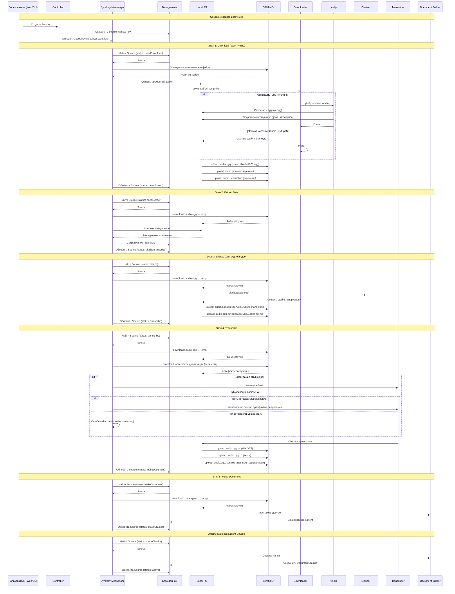

# Sequence Diagram: Обработка источников (AS-IS)

## Диаграмма последовательности

## Легенда участников

| Участник               | Описание                                                     |
| ---------------------- | ------------------------------------------------------------ |
| Пользователь (Web/CLI) | Точка входа - веб-интерфейс или консольная команда           |
| Controller             | Контроллер Symfony, обрабатывающий входящие запросы          |
| Symfony Messenger      | Очередь сообщений для асинхронной обработки                  |
| База данных            | PostgreSQL для хранения метаданных источников                |
| Local FS               | Временная локальная файловая система для обработки           |
| S3/MinIO               | S3-совместимое хранилище для постоянного хранения файлов     |
| Downloader             | Сервис загрузки файлов из различных источников               |
| yt-dlp                 | Утилита для загрузки видео/аудио с YouTube и других платформ |
| Diarizer               | Сервис диаризации (разделения речи по спикерам)              |
| Transcriber            | Сервис транскрибации (преобразования речи в текст)           |
| Document Builder       | Сервис создания документов и чанков                          |

## Потоки данных (Local ↔ S3)

### Этап Download
- **Local → S3**: 
  - `audio.ogg` (основной файл) - ключ: `ab/cd-ef123.ogg`
  - `audio.json` (метаданные) - ключ: `ab/cd-ef123.json`
  - `audio.description` (описание) - ключ: `ab/cd-ef123.description`

### Этап Extract
- **S3 → Local**: `audio.ogg` для извлечения метаданных
- **Local → S3**: дополнительные артефакты (если создаются)

### Этап Diarize
- **S3 → Local**: `audio.ogg` для диаризации
- **Local → S3**: 
  - `audio.ogg.WhisperCpp.Dyes.0.channel.md` (диаризация)
  - `audio.ogg.WhisperCpp.Dno.0.channel.md` (метаданные диаризации)

### Этап Transcribe
- **S3 → Local**: 
  - `audio.ogg` для транскрибации
  - Артефакты диаризации (если есть)
- **Local → S3**:
  - `audio.ogg.vtt` (WebVTT транскрипт)
  - `audio.ogg.txt` (текст транскрипта)
  - `audio.ogg.json` (метаданные транскрипции)

### Этап Make Document/Chunks
- **S3 → Local**: Транскрипт для создания документов
- **Local → S3**: Дополнительные артефакты документов (если создаются)

### Повторные операции
- **S3 → Local (повтор)**: При каждом этапе обработки файлы повторно скачиваются из S3 во временную директорию
- **Local → S3 (повтор)**: После каждого этапа обработки артефакты загружаются обратно в S3

## Ссылки на код

### Основные компоненты workflow
- [`DetermineSourceWorkflowStepService`](src/Module/Source/Application/Service/SourceWorkflow/SourceWorkflowResolver/DetermineSourceWorkflowStepService.php) - Определение следующего шага обработки
- [`LaunchNextSourceWorkflowStepService`](src/Module/Source/Application/Service/SourceWorkflow/LaunchNextSourceWorkflowStep/LaunchNextSourceWorkflowStepService.php) - Запуск следующего шага

### Обработчики команд
- [`DownloadCommandHandler`](src/Module/Source/Application/UseCase/Command/Source/Download/DownloadCommandHandler.php) - Загрузка файлов
- [`ExtractDataCommandHandler`](src/Module/Source/Application/UseCase/Command/Source/ExtractData/ExtractDataCommandHandler.php) - Извлечение данных
- [`DiarizeCommandHandler`](src/Module/Source/Application/UseCase/Command/Source/Diarize/DiarizeCommandHandler.php) - Диаризация
- [`TranscribeCommandHandler`](src/Module/Source/Application/UseCase/Command/Source/Transcribe/TranscribeCommandHandler.php) - Транскрибация
- [`MakeDocumentCommandHandler`](src/Module/Source/Application/UseCase/Command/Source/MakeDocument/MakeDocumentCommandHandler.php) - Создание документов
- [`MakeDocumentChunksCommandHandler`](src/Module/Source/Application/UseCase/Command/Source/MakeDocumentChunks/MakeDocumentChunksCommandHandler.php) - Создание чанков

### Файловое хранилище
- [`S3FileStorage`](src/Component/FileStorage/S3/S3FileStorage.php) - Реализация S3 хранилища
- [`FileStorageService`](src/Module/Source/Domain/Service/FileStorage/FileStorageService.php) - Сервис файлового хранилища
- [`FileWorkspaceService`](src/Module/Source/Infrastructure/Service/FileStorage/FileWorkspaceService.php) - Сервис работы с временными файлами

### Синхронизация артефактов
- [`SyncWorkspaceArtifactsService`](src/Module/Source/Infrastructure/Service/Artifact/SyncWorkspaceArtifactsService.php) - Синхронизация артефактов между S3 и локальной FS
- [`DiarizationArtifactsService`](src/Module/Source/Application/Service/Diarization/DiarizationArtifactsService.php) - Управление артефактами диаризации

### Внешние компоненты
- [`YtDlpComponent`](src/Module/Source/Infrastructure/Component/YtDlp/YtDlpComponent.php) - Интеграция с yt-dlp
- [`YouTubeDownloaderService`](src/Module/Source/Infrastructure/Service/Source/Downloader/YouTubeDownloaderService.php) - Загрузчик YouTube
- [`DiarizerService`](src/Module/Source/Integration/Service/Diarizer/DiarizerService.php) - Сервис диаризации

## TODO/Неясно

1. **Формат ключей S3**: Точный алгоритм формирования ключей в S3 требует дополнительного анализа в [`S3FileStorage::generateUniqueId()`](src/Component/FileStorage/S3/S3FileStorage.php:411)
2. **Обработка ошибок**: Механизм отката при ошибках загрузки в S3 не полностью ясен из текущего кода
3. **Очистка временных файлов**: Не до конца понятно, когда и как происходит очистка временных файлов после каждого этапа
4. **Конкурентная обработка**: Неясно, как обрабатываются ситуации, когда несколько этапов пытаются работать с одним файлом одновременно
5. **Механизм кэширования**: Неясно, есть ли кэширование при повторном скачивании одних и тех же файлов из S3
6. **Мониторинг прогресса**: Механизм отслеживания прогресса длительных операций (загрузка, транскрибация) требует дополнительного анализа
