# Source Processing - C4 Component Diagram (AS-IS)

```mermaid
graph TB
    %% Точки входа
    subgraph "Entry Points"
        HTTP[HTTP API Controller]
        CLI[CLI Commands]
    end
    
    %% Application Layer
    subgraph "Application Layer"
        UC_CreateByUri[CreateByUri UseCase]
        UC_Download[Download UseCase]
        UC_ExtractData[ExtractData UseCase]
        UC_Diarize[Diarize UseCase]
        UC_Transcribe[Transcribe UseCase]
        UC_MakeDocument[MakeDocument UseCase]
        UC_MakeDocumentChunks[MakeDocumentChunks UseCase]
    end
    
    %% Messaging Layer
    subgraph "Messenger Layer"
        MB_Download[source_download Queue]
        MB_Extract[source_extract Queue]
        MB_Diarize[source_diarize Queue]
        MB_Transcribe[source_transcribe Queue]
        MB_MakeDocument[source_make_document Queue]
        MB_MakeDocumentChunks[source_make_document_chunks Queue]
        MB_Events[source_events Queue]
    end
    
    %% Infrastructure Services
    subgraph "Infrastructure Services"
        FS_FileStorage[FileStorage Service]
        FS_FileWorkspace[FileWorkspace Service]
        FS_ArtifactsSync[SyncWorkspaceArtifacts Service]
        DS_Downloader[Downloader Service]
        DS_Diarizer[Diarizer Service]
        DS_Transcriber[Transcriber Service]
    end
    
    %% Storage Components
    subgraph "Storage Layer"
        subgraph "Local File System"
            LFS_Source[Local Source Storage]
            LFS_Cache[Local Cache/Workdir]
        end
        
        subgraph "S3/MinIO Storage"
            S3_Source[S3 Source Bucket]
            S3_Artifacts[S3 Artifacts Bucket]
        end
        
        FS_Flysystem[Flysystem Adapter]
    end
    
    %% External Tools
    subgraph "External Tools"
        ET_YtDlp[yt-dlp]
        ET_Ffmpeg[ffmpeg]
        ET_Whisper[whisper]
        ET_Diarization[Diarization Engine]
    end
    
    %% Database
    subgraph "Database"
        DB_Source[Source Entity]
        DB_Comments[Source Comments]
        DB_Documents[Documents]
        DB_Chunks[Document Chunks]
    end
    
    %% Connections - Entry Points to Application
    HTTP --> UC_CreateByUri
    CLI --> UC_CreateByUri
    
    %% Connections - Application to Messenger
    UC_CreateByUri --> MB_Download
    UC_Download --> MB_Extract
    UC_ExtractData -.-> MB_Diarize
    UC_ExtractData -.-> MB_Transcribe
    UC_Diarize --> MB_Transcribe
    UC_Transcribe --> MB_MakeDocument
    UC_MakeDocument --> MB_MakeDocumentChunks
    
    %% Connections - Messenger to Application Handlers
    MB_Download --> UC_Download
    MB_Extract --> UC_ExtractData
    MB_Diarize --> UC_Diarize
    MB_Transcribe --> UC_Transcribe
    MB_MakeDocument --> UC_MakeDocument
    MB_MakeDocumentChunks --> UC_MakeDocumentChunks
    
    %% Connections - Application to Infrastructure
    UC_Download --> FS_FileWorkspace
    UC_Download --> DS_Downloader
    UC_Download --> FS_ArtifactsSync
    UC_ExtractData --> FS_FileWorkspace
    UC_ExtractData --> FS_ArtifactsSync
    UC_Diarize --> FS_FileWorkspace
    UC_Diarize --> DS_Diarizer
    UC_Diarize --> FS_ArtifactsSync
    UC_Transcribe --> FS_FileWorkspace
    UC_Transcribe --> DS_Transcriber
    UC_Transcribe --> FS_ArtifactsSync
    
    %% Connections - Infrastructure to Storage
    FS_FileWorkspace --> FS_FileStorage
    FS_FileStorage --> FS_Flysystem
    FS_ArtifactsSync --> FS_FileStorage
    
    %% Connections - Storage to Local FS
    FS_Flysystem -.-> LFS_Source
    FS_Flysystem -.-> LFS_Cache
    
    %% Connections - Storage to S3/MinIO
    FS_Flysystem -.-> S3_Source
    FS_Flysystem -.-> S3_Artifacts
    
    %% Connections - External Tools
    DS_Downloader --> ET_YtDlp
    DS_Downloader --> ET_Ffmpeg
    DS_Transcriber --> ET_Whisper
    DS_Diarizer --> ET_Diarization
    
    %% Connections - Application to Database
    UC_CreateByUri --> DB_Source
    UC_Download --> DB_Source
    UC_ExtractData --> DB_Source
    UC_ExtractData --> DB_Comments
    UC_Diarize --> DB_Source
    UC_Transcribe --> DB_Source
    UC_MakeDocument --> DB_Source
    UC_MakeDocument --> DB_Documents
    UC_MakeDocumentChunks --> DB_Documents
    UC_MakeDocumentChunks --> DB_Chunks
    
    %% Data Flow Labels
    FS_FileWorkspace -.->|"download (temp files)"| LFS_Cache
    LFS_Cache -.->|"upload (processed files)"| FS_FileStorage
    FS_FileStorage -.->|"upload (artifacts)"| S3_Artifacts
    S3_Source -.->|"download (source files)"| FS_FileStorage
    FS_ArtifactsSync -.->|"sync artifacts"| S3_Artifacts
    S3_Artifacts -.->|"hydrate artifacts"| FS_ArtifactsSync
    
    %% Styling
    classDef entryPoint fill:#e1f5fe
    classDef application fill:#f3e5f5
    classDef messenger fill:#fff3e0
    classDef infrastructure fill:#e8f5e8
    classDef storage fill:#fce4ec
    classDef external fill:#fff8e1
    classDef database fill:#f1f8e9
    
    class HTTP,CLI entryPoint
    class UC_CreateByUri,UC_Download,UC_ExtractData,UC_Diarize,UC_Transcribe,UC_MakeDocument,UC_MakeDocumentChunks application
    class MB_Download,MB_Extract,MB_Diarize,MB_Transcribe,MB_MakeDocument,MB_MakeDocumentChunks,MB_Events messenger
    class FS_FileStorage,FS_FileWorkspace,FS_ArtifactsSync,DS_Downloader,DS_Diarizer,DS_Transcriber infrastructure
    class LFS_Source,LFS_Cache,S3_Source,S3_Artifacts,FS_Flysystem storage
    class ET_YtDlp,ET_Ffmpeg,ET_Whisper,ET_Diarization external
    class DB_Source,DB_Comments,DB_Documents,DB_Chunks database
```

## Список компонентов

### Точки входа
- **HTTP API Controller** - Обрабатывает HTTP-запросы на создание источников
- **CLI Commands** - Предоставляет консольные команды для управления источниками

### Application Layer
- **CreateByUri UseCase** - Создание нового источника по URI
- **Download UseCase** - Загрузка файлов источника в хранилище
- **ExtractData UseCase** - Извлечение метаданных и комментариев из источника
- **Diarize UseCase** - Диаризация аудио/видео источников
- **Transcribe UseCase** - Транскрибация аудио/видео источников
- **MakeDocument UseCase** - Создание документов на основе обработанного источника
- **MakeDocumentChunks UseCase** - Создание чанков документов для RAG

### Messenger Layer
- **source_download Queue** - Очередь для задач загрузки
- **source_extract Queue** - Очередь для задач извлечения данных
- **source_diarize Queue** - Очередь для задач диаризации
- **source_transcribe Queue** - Очередь для задач транскрибации
- **source_make_document Queue** - Очередь для задач создания документов
- **source_make_document_chunks Queue** - Очередь для задач создания чанков
- **source_events Queue** - Очередь для событий источников

### Infrastructure Services
- **FileStorage Service** - Абстракция над файловым хранилищем (Local/S3)
- **FileWorkspace Service** - Temporary workspace (cleanup на каждый вызов); cached workspace планируется отдельной задачей
- **SyncWorkspaceArtifacts Service** - Синхронизация артефактов между workspace и хранилищем
- **Downloader Service** - Загрузка файлов из различных источников (YouTube, RuTube и др.)
- **Diarizer Service** - Интеграция с диаризацией через SpeechToText модуль
- **Transcriber Service** - Интеграция с транскрибацией через SpeechToText модуль

### Storage Layer
- **Local Source Storage** - Локальное хранилище исходных файлов
- **Local Cache/Workdir** - Временная директория для обработки файлов
- **S3 Source Bucket** - S3/MinIO бакет для исходных файлов
- **S3 Artifacts Bucket** - S3/MinIO бакет для артефактов обработки
- **Flysystem Adapter** - Абстракция над различными файловыми системами

### External Tools
- **yt-dlp** - Загрузка видео с YouTube, RuTube и других платформ
- **ffmpeg** - Обработка аудио/видео файлов
- **whisper** - Распознавание речи
- **Diarization Engine** - Диаризация аудио/видео

### Database
- **Source Entity** - Основная сущность источника
- **Source Comments** - Комментарии к источникам
- **Documents** - Документы, созданные из источников
- **Document Chunks** - Чанки документов для RAG

## Ссылки на код

### Точки входа
- HTTP API: `apps/web/src/Controller/Source/CreateByUriAction.php`
- CLI Commands: `apps/console/src/Command/Source/`

### Application Layer
- CreateByUri: `src/Module/Source/Application/UseCase/Command/Source/CreateByUri/CreateByUriCommandHandler.php`
- Download: `src/Module/Source/Application/UseCase/Command/Source/Download/DownloadCommandHandler.php`
- ExtractData: `src/Module/Source/Application/UseCase/Command/Source/ExtractData/ExtractDataCommandHandler.php`
- Diarize: `src/Module/Source/Application/UseCase/Command/Source/Diarize/DiarizeCommandHandler.php`
- Transcribe: `src/Module/Source/Application/UseCase/Command/Source/Transcribe/TranscribeCommandHandler.php`
- MakeDocument: `src/Module/Source/Application/UseCase/Command/Source/MakeDocument/MakeDocumentCommandHandler.php`
- MakeDocumentChunks: `src/Module/Source/Application/UseCase/Command/Source/MakeDocumentChunks/MakeDocumentChunksCommandHandler.php`

### Infrastructure Services
- FileStorage: `src/Module/Source/Domain/Service/FileStorage/FileStorageService.php`
- FileWorkspace: `src/Module/Source/Infrastructure/Service/FileStorage/FileWorkspaceService.php`
- SyncWorkspaceArtifacts: `src/Module/Source/Infrastructure/Service/Artifact/SyncWorkspaceArtifactsService.php`
- Downloader: `src/Module/Source/Infrastructure/Service/Source/Downloader/DownloaderService.php`
- Diarizer: `src/Module/Source/Integration/Service/Diarizer/DiarizerService.php`
- Transcriber: `src/Module/Source/Integration/Service/Transcriber/TranscriberService.php`

### Storage Configuration
- Storage: `config/packages/storage.php`

### Database Entities
- Source: `src/Module/Source/Domain/Entity/SourceModel.php`
- Source Comments: `src/Module/Source/Domain/Entity/SourceCommentModel.php`

## TODO/Неясно

1. **Convert UseCase** - В коде не найден ConvertCommandHandler, хотя в ExtractDataCommandHandler есть логика определения необходимости конвертации. Неясно, существует ли отдельный UseCase для конвертации или она выполняется в рамках других этапов.

2. **Детальная интеграция с SpeechToText** - Диаризация и транскрибация делегируются SpeechToText модулю, но детали реализации взаимодействия требуют дополнительного изучения кода этого модуля.

3. **Механизм очистки временных файлов** - Не до конца ясна политика очистки временных файлов в Local Cache/Workdir после завершения обработки.

4. **Обработка ошибок при работе с S3/MinIO** - Требует дополнительного изучения механизм обработки ошибок при недоступности S3/MinIO хранилища.

5. **Конфигурация External Tools** - Неясно, где именно конфигурируются пути к внешним утилитам (yt-dlp, ffmpeg, whisper) и как происходит проверка их доступности.
