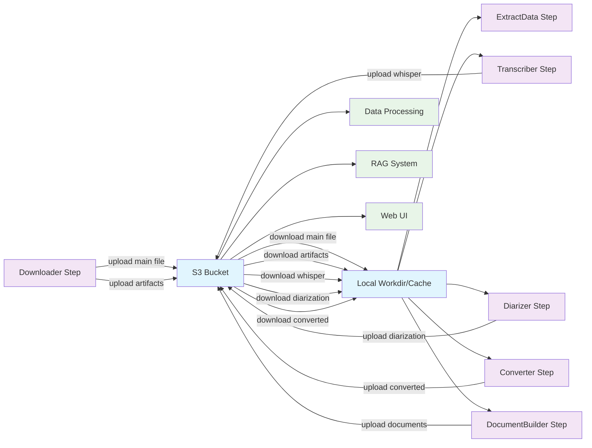

# Потоки данных Local FS ↔ S3/MinIO (AS-IS)

## Источник правды (Canonical Storage)

**S3/MinIO является canonical storage** в проекте. Это подтверждается следующими фактами:

1. **Конфигурация по умолчанию** в [`config/packages/storage.php`](config/packages/storage.php:51) переключается на S3 при `STORAGE_DRIVER=s3`
2. **Миграционная команда** [`MigrateToFileSystemCommand`](apps/console/src/Module/Source/Command/MigrateToFileSystemCommand.php:22) предназначена для переноса данных из Local FS в S3
3. **Web-контроллер** [`FileController`](apps/web/src/Module/Source/Controller/Source/FileController.php:67) определяет тип хранилища и для S3 отдает контент напрямую
4. **GitHub источники** — единственное исключение, которое требует локальное хранилище (см. [`GithubDocumentContentsBuilder.php:41`](src/Module/Source/Infrastructure/Service/DocumentContentsBuilder/GithubDocumentContentsBuilder.php:41))

## Immutability keys (Storage contract)

Для безопасного локального кэша и переиспользования локальных копий файлов/артефактов вводится правило:

- **S3/MinIO object keys immutable**: один key соответствует одному конкретному содержимому.
- **Overwrite запрещён**: если объект с таким key уже существует, повторная запись должна завершаться ошибкой или быть пропущена.
- **Новая “версия” = новый key**: при повторной загрузке/перегенерации результата нужно формировать новый key (например через `generateStorageFilename()`), а не перезаписывать старый.

Технически это закреплено на уровне `FileStorageInterface::storeFromPath()` и реализаций (Local/Flysystem/S3).

Исключение: некоторые артефакты обработки могут быть пересозданы и заменены “на месте” (delete+upload по тому же key). Это означает, что для будущего локального кэша потребуется инвалидация (ETag/LastModified/versioning).

## Таблица артефактов

| Артефакт | Где рождается | Куда пишется (Local/S3) | Где читается | Повторы (скачивание/заливка) | Код (ссылки) | Примечания/кэш-кандидат |
|----------|---------------|-------------------------|--------------|----------------------------|--------------|------------------------|
| **Основной файл источника** | Downloader | Local → S3 | Все шаги обработки | Да: S3 → Local → S3 | [`DownloadCommandHandler:86-99`](src/Module/Source/Application/UseCase/Command/Source/Download/DownloadCommandHandler.php:86), [`FileWorkspaceService:55-71`](src/Module/Source/Infrastructure/Service/FileStorage/FileWorkspaceService.php:55) | Кандидат на оптимизацию |
| **Артефакты загрузки** (.description, .info.json) | Downloader | Local → S3 | ExtractData | Да: S3 → Local | [`SyncWorkspaceArtifactsService:20-56`](src/Module/Source/Infrastructure/Service/Artifact/SyncWorkspaceArtifactsService.php:20) | Избыточные перемещения |
| **Whisper артефакты** (.ogg.WhisperCpp.D*) | Transcriber | Local → S3 | DocumentBuilder | Да: S3 → Local | [`DiarizationArtifactsService:23-36`](src/Module/Source/Application/Service/Diarization/DiarizationArtifactsService.php:23) | Кандидат на кэширование |
| **Конвертированные файлы** (PDF из DjVu) | DjvuConverter | Local → S3 | DocumentBuilder | Да: S3 → Local | [`DjvuConversionService:64-72`](src/Module/Source/Infrastructure/Service/Source/Djvu/DjvuConversionService.php:64) | Двойное преобразование |
| **Документы** (HTML, Markdown) | DocumentBuilder | S3 | RAG система | Нет | [`DoclingPdfDocumentContentsBuilder:36-38`](src/Module/Source/Infrastructure/Service/DocumentContentsBuilder/DoclingPdfDocumentContentsBuilder.php:36) | Финальное хранилище |
| **Аватары** | User upload | Local/S3 | Web интерфейс | Нет | [`FileController:51-64`](apps/web/src/Module/Source/Controller/Source/FileController.php:51) | Прямое чтение из S3 |

## Mermaid Flowchart

## Лишние перемещения

### 1. Избыточные скачивания основного файла

**Проблема:** Файл источника скачивается из S3 в Local для каждого шага обработки:
- [`ExtractDataCommandHandler:91-104`](src/Module/Source/Application/UseCase/Command/Source/ExtractData/ExtractDataCommandHandler.php:91) - скачивание для извлечения данных
- [`TranscribeCommandHandler:91-120`](src/Module/Source/Application/UseCase/Command/Source/Transcribe/TranscribeCommandHandler.php:91) - скачивание для транскрипции
- [`DiarizeCommandHandler:88-100`](src/Module/Source/Application/UseCase/Command/Source/Diarize/DiarizeCommandHandler.php:88) - скачивание для диаризации

**Решение:** Реализовать локальное кэширование между шагами обработки.

### 2. Двойная синхронизация артефактов

**Проблема:** Артефакты синхронизируются дважды:
1. При загрузке: [`SyncWorkspaceArtifactsService:20-56`](src/Module/Source/Infrastructure/Service/Artifact/SyncWorkspaceArtifactsService.php:20)
2. При обработке: [`DiarizationArtifactsService:38-57`](src/Module/Source/Application/Service/Diarization/DiarizationArtifactsService.php:38)

**Решение:** Объединить логику синхронизации в одном сервисе.

### 3. Промежуточные конвертации

**Проблема:** DjVu → PDF конвертация создает временные файлы:
- [`DjvuConversionService:64-72`](src/Module/Source/Infrastructure/Service/Source/Djvu/DjvuConversionService.php:64) - скачивание в Local
- Конвертация в Local
- Загрузка обратно в S3

**Решение:** Рассмотреть streaming конвертацию напрямую из S3 в S3.

### 4. GitHub источники в S3

**Проблема:** GitHub источники не поддерживаются в S3 режиме:
- [`GithubDocumentContentsBuilder:41-42`](src/Module/Source/Infrastructure/Service/DocumentContentsBuilder/GithubDocumentContentsBuilder.php:41)

**Решение:** Реализовать поддержку GitHub источников в S3 или явно задокументировать ограничение.

## Рекомендации по оптимизации

1. **Ввести локальный кэш** между шагами обработки для уменьшения количества скачиваний
2. **Объединить сервисы синхронизации** артефактов для устранения дублирования
3. **Реализовать streaming обработку** для конвертации файлов без промежуточного сохранения
4. **Добавить метрики** для мониторинга количества перемещений файлов
5. **Рассмотреть возможность** обработки некоторых артефактов напрямую в S3 без скачивания
