# Схема обработки источников

```mermaid
flowchart TD
    %% Начальные точки создания источников
    CreateByUri[Создание по URI] --> CreateByUriHandler
    CreateByFile[Создание из файла] --> CreateByFileHandler
    CreateByContent[Создание из контента] --> CreateByContentHandler
    
    %% Обработчики создания
    CreateByUriHandler["CreateByUriCommandHandler<br/>src/Module/Source/Application/UseCase/Command/Source/CreateByUri/CreateByUriCommandHandler.php"]
    CreateByFileHandler["CreateByFileCommandHandler<br/>src/Module/Source/Application/UseCase/Command/Source/CreateByFile/CreateByFileCommandHandler.php"]
    CreateByContentHandler["CreateByContentCommandHandler<br/>src/Module/Source/Application/UseCase/Command/Source/CreateByContent/CreateByContentCommandHandler.php"]
    
    %% Общий поток после создания
    CreateByUriHandler --> NewSource
    CreateByFileHandler --> NewSource
    CreateByContentHandler --> NewSource
    
    NewSource[Источник создан<br/>status: new] --> LaunchNextStep
    
    LaunchNextStep["LaunchNextSourceWorkflowStepService<br/>src/Module/Source/Application/Service/SourceWorkflow/LaunchNextSourceWorkflowStep/LaunchNextSourceWorkflowStepService.php"]
    
    %% Определение следующего шага
    LaunchNextStep --> DetermineStep
    DetermineStep["DetermineSourceWorkflowStepService<br/>src/Module/Source/Application/Service/SourceWorkflow/SourceWorkflowResolver/DetermineSourceWorkflowStepService.php"]
    
    %% Ветвление в зависимости от типа источника
    DetermineStep --> CheckFilename{Есть файл?}
    CheckFilename -->|Да| ExtractStep
    CheckFilename -->|Нет| DownloadStep
    
    %% Шаг 1: Скачивание
    DownloadStep[Шаг: download] --> DownloadCommand
    DownloadCommand["DownloadCommandHandler<br/>src/Module/Source/Application/UseCase/Command/Source/Download/DownloadCommandHandler.php"]
    DownloadCommand --> Downloading[Скачивание...<br/>status: downloadInProgress]
    Downloading --> Downloaded[Скачано<br/>status: needExtract]
    Downloaded --> DownloadedEvent["DownloadedEvent<br/>src/Module/Source/Application/Event/Source/DownloadedEvent.php"]
    DownloadedEvent --> LaunchNextStep
    
    %% Шаг 2: Извлечение данных
    ExtractStep[Шаг: extract] --> ExtractCommand
    ExtractCommand["ExtractDataCommandHandler<br/>src/Module/Source/Application/UseCase/Command/Source/ExtractData/ExtractDataCommandHandler.php"]
    ExtractCommand --> Extracting[Извлечение данных...<br/>status: extractInProgress]
    Extracting --> Extracted[Данные извлечены<br/>status: convert/diarize/transcribe]
    Extracted --> DataExtractedEvent["DataExtractedEvent<br/>src/Module/Source/Application/Event/Source/DataExtractedEvent.php"]
    DataExtractedEvent --> LaunchNextStep
    
    %% Шаг 3: Конвертация (только для DJVU)
    LaunchNextStep --> CheckType{Тип источника}
    CheckType -->|DJVU| ConvertStep
    CheckType -->|Аудио/Видео| DiarizeStep
    CheckType -->|Другие| TranscribeStep
    
    ConvertStep[Шаг: convert] --> ConvertCommand
    ConvertCommand["ConvertDjvuCommandHandler<br/>src/Module/Source/Application/UseCase/Command/Source/ConvertDjvu/ConvertDjvuCommandHandler.php"]
    ConvertCommand --> Converting[Конвертация...<br/>status: convertInProgress]
    Converting --> Converted[Сконвертировано<br/>status: transcribe]
    Converted --> LaunchNextStep
    
    %% Шаг 4: Диаризация (для аудио/видео)
    DiarizeStep[Шаг: diarize] --> DiarizeCommand
    DiarizeCommand["DiarizeCommandHandler<br/>src/Module/Source/Application/UseCase/Command/Source/Diarize/DiarizeCommandHandler.php"]
    DiarizeCommand --> Diarizing[Диаризация...<br/>status: diarizeInProgress]
    Diarizing --> Diarized[Диаризовано<br/>status: transcribe]
    Diarized --> DiarizedEvent["DiarizedEvent<br/>src/Module/Source/Application/Event/Source/DiarizedEvent.php"]
    DiarizedEvent --> LaunchNextStep
    
    %% Шаг 5: Транскрибация
    TranscribeStep[Шаг: transcribe] --> TranscribeCommand
    TranscribeCommand["TranscribeCommandHandler<br/>src/Module/Source/Application/UseCase/Command/Source/Transcribe/TranscribeCommandHandler.php"]
    TranscribeCommand --> Transcribing[Транскрибация...<br/>status: transcribeInProgress]
    Transcribing --> Transcribed[Транскрибировано<br/>status: makeDocument]
    Transcribed --> TranscribedEvent["TranscribedEvent<br/>src/Module/Source/Application/Event/Source/TranscribedEvent.php"]
    TranscribedEvent --> LaunchNextStep
    
    %% Шаг 6: Создание документа
    LaunchNextStep --> MakeDocumentStep
    MakeDocumentStep[Шаг: makeDocument] --> MakeDocumentCommand
    MakeDocumentCommand["MakeDocumentCommandHandler<br/>src/Module/Source/Application/UseCase/Command/Source/MakeDocument/MakeDocumentCommandHandler.php"]
    MakeDocumentCommand --> MakingDocument[Создание документа...<br/>status: makeDocumentInProgress]
    MakingDocument --> DocumentMade[Документ создан<br/>status: makeChunks]
    DocumentMade --> DocumentMadeEvent["DocumentMadeEvent<br/>src/Module/Source/Application/Event/Source/DocumentMadeEvent.php"]
    DocumentMadeEvent --> LaunchNextStep
    
    %% Шаг 7: Создание чанков
    LaunchNextStep --> MakeChunksStep
    MakeChunksStep[Шаг: makeDocumentChunks] --> MakeChunksCommand
    MakeChunksCommand["MakeDocumentChunksCommandHandler<br/>src/Module/Source/Application/UseCase/Command/Source/MakeDocumentChunks/MakeDocumentChunksCommandHandler.php"]
    MakeChunksCommand --> MakingChunks[Создание чанков...<br/>status: makeChunksInProgress]
    MakingChunks --> CheckAllDocs{Все документы готовы?}
    CheckAllDocs -->|Нет| DocumentChunksMade[Чанки созданы<br/>status: makeChunks]
    CheckAllDocs -->|Да| Active[Источник активен<br/>status: active]
    DocumentChunksMade --> DocumentChunksMadeEvent["DocumentChunksMadeEvent<br/>src/Module/Source/Application/Event/Source/DocumentChunksMadeEvent.php"]
    DocumentChunksMadeEvent --> LaunchNextStep
    Active --> End[Обработка завершена]
    
    %% Стили
    classDef handler fill:#e1f5fe,stroke:#01579b,stroke-width:2px
    classDef event fill:#f3e5f5,stroke:#4a148c,stroke-width:2px
    classDef status fill:#e8f5e8,stroke:#2e7d32,stroke-width:2px
    classDef process fill:#fff3e0,stroke:#e65100,stroke-width:2px
    classDef decision fill:#fce4ec,stroke:#880e4f,stroke-width:2px
    
    class CreateByUriHandler,CreateByFileHandler,CreateByContentHandler,DownloadCommand,ExtractCommand,ConvertCommand,DiarizeCommand,TranscribeCommand,MakeDocumentCommand,MakeChunksCommand handler
    class DownloadedEvent,DataExtractedEvent,DiarizedEvent,TranscribedEvent,DocumentMadeEvent,DocumentChunksMadeEvent event
    class NewSource,Downloading,Downloaded,Extracting,Extracted,Converting,Converted,Diarizing,Diarized,Transcribing,Transcribed,MakingDocument,DocumentMade,MakingChunks,DocumentChunksMade,Active status
    class CreateByUri,CreateByFile,CreateByContent,LaunchNextStep,DetermineStep,DownloadStep,ExtractStep,ConvertStep,DiarizeStep,TranscribeStep,MakeDocumentStep,MakeChunksStep process
    class CheckFilename,CheckType,CheckAllDocs decision
```

## Описание схемы

Схема показывает полный цикл обработки источника от создания до активации:

1. **Создание источника** - три возможных способа:
   - `CreateByUriCommandHandler` - создание по URI
   - `CreateByFileCommandHandler` - создание из файла
   - `CreateByContentCommandHandler` - создание из контента

2. **Определение следующего шага** - `LaunchNextSourceWorkflowStepService` определяет следующий шаг на основе типа источника и текущего статуса

3. **Основные шаги обработки**:
   - **Download** - скачивание файла по URI
   - **Extract** - извлечение метаданных и данных
   - **Convert** - конвертация DJVU в PDF (только для DJVU)
   - **Diarize** - разделение на говорящих (для аудио/видео)
   - **Transcribe** - транскрибация аудио/видео в текст
   - **MakeDocument** - создание документа на основе извлеченных данных
   - **MakeDocumentChunks** - создание чанков для RAG

4. **События** - после каждого шага генерируется соответствующее событие, которое может быть обработано другими частями системы

5. **Завершение** - источник становится активным (`status: active`) и готов к использованию

## Типы источников и их пути обработки

- **Текстовые источники** (text): extract → transcribe → makeDocument → makeDocumentChunks
- **Мультимедиа** (video, youtube, rutube, audio): download → extract → diarize → transcribe → makeDocument → makeDocumentChunks
- **PDF**: download → extract → transcribe → makeDocument → makeDocumentChunks
- **DJVU**: download → extract → convert → transcribe → makeDocument → makeDocumentChunks
- **HTML**: download → extract → transcribe → makeDocument → makeDocumentChunks
- **Confluence**: download → extract → transcribe → makeDocument → makeDocumentChunks
- **GitHub**: download → extract → transcribe → makeDocument → makeDocumentChunks
