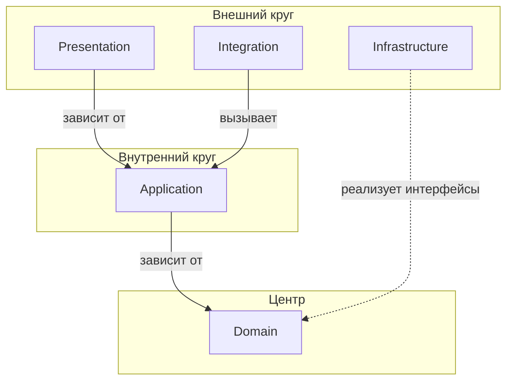

# Взаимодействие слоёв (Layer Interaction)

**Взаимодействие слоёв** — правила зависимостей между слоями архитектуры, основанные на принципах Clean Architecture (луковичная архитектура).

Подробнее: [Clean Architecture by Robert C. Martin](https://blog.cleancoder.com/uncle-bob/2012/08/13/the-clean-architecture.html)

## Общие правила

- Зависимости направлены **только внутрь**, к центру
- Внутренние слои не зависят от внешних
- Внешние слои зависят от внутренних через абстракции (интерфейсы)
- DI-контейнер связывает интерфейсы с реализациями на уровне конфигурации

## Диаграмма зависимостей

## Описание слоёв

| Слой | Назначение | Зависимости |
|------|------------|-------------|
| **Domain** | Бизнес-логика, сущности, Value Object, интерфейсы репозиториев | Нет |
| **Application** | Use Cases, оркестрация, DTO | Domain |
| **Infrastructure** | Реализация репозиториев, кэш, персистентность | Domain (интерфейсы) |
| **Integration** | Внешние API, события, межмодульное взаимодействие | Application |
| **Presentation** | Web, API, Console, Blog — точки входа | Application |

## Правила взаимодействия

### Domain → (никто)

Domain слой не зависит ни от кого:
- Нет зависимостей на Application, Infrastructure, Integration, Presentation
- Может использовать только стандартные типы PHP и свои интерфейсы

### Application → Domain

Application зависит только от Domain:
- Вызывает методы сущностей и Value Object
- Использует интерфейсы репозиториев из Domain
- Использует спецификации и сервисы из Domain

### Infrastructure → Domain

Infrastructure реализует интерфейсы Domain:
- Реализует `RepositoryInterface` из Domain
- Подключается через DI-контейнер
- Не используется напрямую из Application

### Integration → Application

Integration вызывает Application:
- Обрабатывает внешние события и вызывает Use Cases
- Не зависит от Infrastructure
- Реализует антикоррупционный слой (ACL)

### Presentation → Application

Presentation зависит только от Application:
- Контроллеры вызывают Command/Query через Handler
- Не обращается к Domain, Infrastructure, Integration напрямую
- Валидация на уровне формы/DTO

## Матрица зависимостей

| Откуда ↓ / Куда → | Domain | Application | Infrastructure | Integration | Presentation |
|-------------------|--------|-------------|----------------|-------------|--------------|
| **Domain** | — | ❌ | ❌ | ❌ | ❌ |
| **Application** | ✅ | — | ❌ | ❌ | ❌ |
| **Infrastructure** | ✅ | ❌ | — | ❌ | ❌ |
| **Integration** | ❌ | ✅ | ❌ | — | ❌ |
| **Presentation** | ❌ | ✅ | ❌ | ❌ | — |
