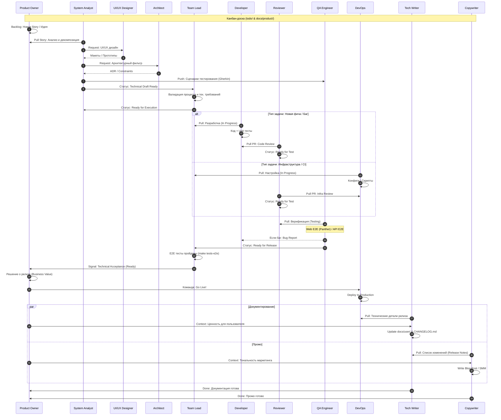

# Software Development Life Cycle (SDLC) & Kanban

Процесс разработки TasK основан на принципах **Kanban**: поток задач визуализирован, сигналы минимизированы, а движение управляется состоянием доски в `todo/`.

## Workflow (Sequence Diagram)

## Колонки Канбан-доски

Процесс визуализирован через статусы задач в `todo/`:

1.  **Backlog:** Идеи от **Product Owner**.
2.  **Analysis:** Работа **System Analyst**, **UI/UX Designer** и **Architect**.
3.  **Ready for Dev/Infra:** Проверено **Team Lead**. Очередь исполнения.
4.  **In Progress:** Активная работа (**Dev** или **DevOps**).
5.  **Review:** Аудит от **Reviewer**.
6.  **Testing:** Верификация от **QA**.
7.  **Ready for Release:** Ждет решения **Product Owner**.
8.  **Deployment:** Выкатка в Prod от **DevOps**.
9.  **Done:** Работа **Tech Writer** и **Copywriter** завершена.

## Принципы потока

*   **WIP Limits:** Агенты не берут новую задачу, пока не завершили текущую.
*   **Pull System:** Исполнители сами берут задачи из очереди "Ready", согласованной Лидом.
*   **Knowledge Enrichment:** Задача обогащается на каждом этапе (ТЗ -> Код -> Тесты -> Доки).
*   **Team Lead Role:** Выступает "вратарём" (Technical Gatekeeper), проверяя качество постановки перед разработкой и подтверждая тех. готовность перед бизнесом.
