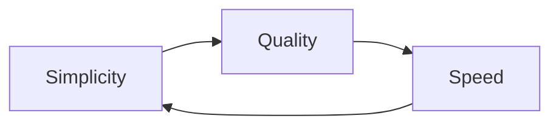

> **Note:** This translation was performed by Gemini CLI (gemini-3-flash-preview).

# TasK Product Mission

TasK is an intelligent pipeline that automates routine document and media processing, freeing people to make decisions rather than collect information.

## Mission

To provide individuals and teams with digital sovereignty: full control over data and infrastructure (self-hosted), open standards, independence from vendor lock-in, and a priority on open solutions and local processing.

TasK transforms the chaos of unstructured data into a manageable knowledge base, accessible for search and analysis.

**Key Focus:** Delivering AI (LLM) value to the user in the most convenient way possible — making the capabilities of modern language models accessible through a simple and intuitive interface.

---

## Principles

Principles define priorities when making product decisions.

### 1. Simplicity and Convenience

**Ease of perception** — priority #1. The interface must be intuitively clear, minimalist, and require no training.

- Remove everything that does not benefit the user
- One screen — one task
- Explicit visual order: highlight the important, dim the secondary

### 2. Quality

**Not at the expense of simplicity and convenience.** Quality code and a reliable system are the foundation, but the user should not suffer from over-engineering.

- Stability and predictability of behavior
- Error handling with clear messages
- Performance as part of the UX

### 3. Speed

**Not at the expense of quality.** Rapid delivery of value is important, but not at the cost of technical debt that will slow us down in the future.

- MVP First — minimum first, perfect later
- Measurable progress at each iteration
- Technical debt is recorded and planned for elimination

### 4. Balance

Constant search for the optimal ratio between simplicity, quality, and speed:

- **Simplicity** — the base we do not abandon
- **Quality** — the minimum that ensures reliability
- **Speed** — the result of balance, not a sacrifice of quality

---

## Priority in Conflict

**simplicity > quality > speed**

When a choice must be made, sacrifice speed for quality, and quality for simplicity.
