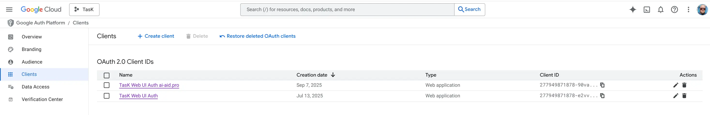
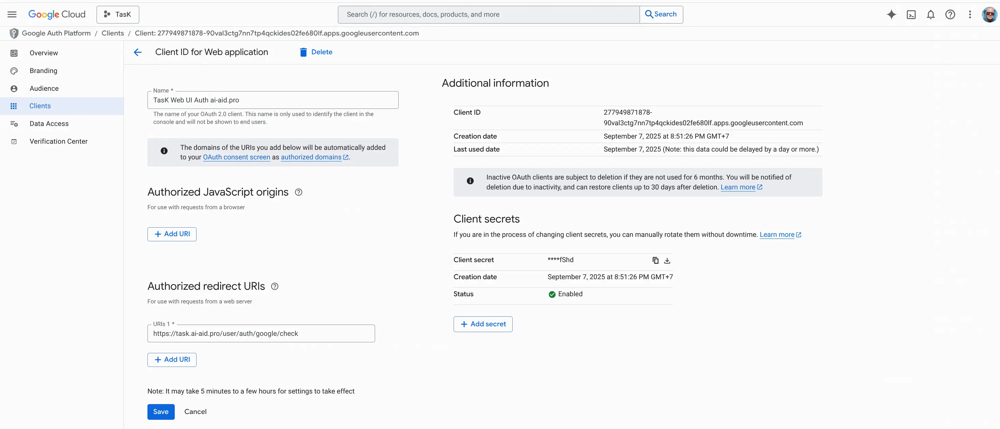

# Подключение Google OAuth для аутентификации

Эта инструкция поможет настроить аутентификацию в проекте через Google OAuth.

## 1. Создание OAuth-клиента

1. Откройте [Google Cloud Console](https://console.cloud.google.com/).
2. Перейдите в раздел **«APIs & Services» → «Credentials»**.
3. Нажмите **«+ Create Credentials»** и выберите **«OAuth client ID»**.



## 2. Настройка параметров клиента

Вам будет предложена форма для заполнения.

* **Application type:** Выберите **«Web application»**.
* **Name:** Укажите произвольное имя, например, `TasK Web (dev)`.

### Authorized redirect URIs

В этот список необходимо добавить URI, на который Google будет перенаправлять пользователя после аутентификации.

* Для окружения Development используйте: `https://task.localhost:8443/user/auth/google/check`.
* Для production-окружения используйте: `https://task.ai-aid.pro/user/auth/google/check`.



После заполнения нажмите кнопку **«Create»**.

## 3. Получение учетных данных

После создания клиента Google предоставит вам:

1. **Your Client ID**
2. **Your Client Secret**
3. Возможность скачать **файл JSON** со всеми данными (обычно `client_secret.json`).

## 4. Настройка окружения

Для настройки **процесса входа** пользователя вам понадобятся `Client ID`, `Client Secret` и `Client secret JSON`.

Скопируйте блок ниже в ваш локальный файл `.env.local` и заполните его данными, полученными на предыдущем шаге.
Поместите скачанный JSON-файл в директорию /secrets/ в корне проекта. Директория `/secrets/` добавлена в `.gitignore`,
поэтому файл с учетными данными не попадет в репозиторий.

```dotenv
###> google/apiclient ###
GOOGLE_CLIENT_ID="<Your Client ID>"
GOOGLE_CLIENT_SECRET="<Your Client Secret>"
GOOGLE_AUTH_CONFIG=%kernel.project_dir%/secrets/client_secret.json
###< google/apiclient ###
```

Рекомендации по настройке OAuth в песочницах см. в разделе «Песочницы (Sandbox)» файла
[index.md](index.md).
