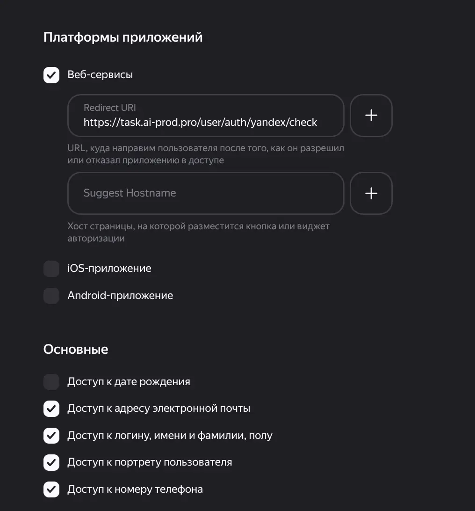
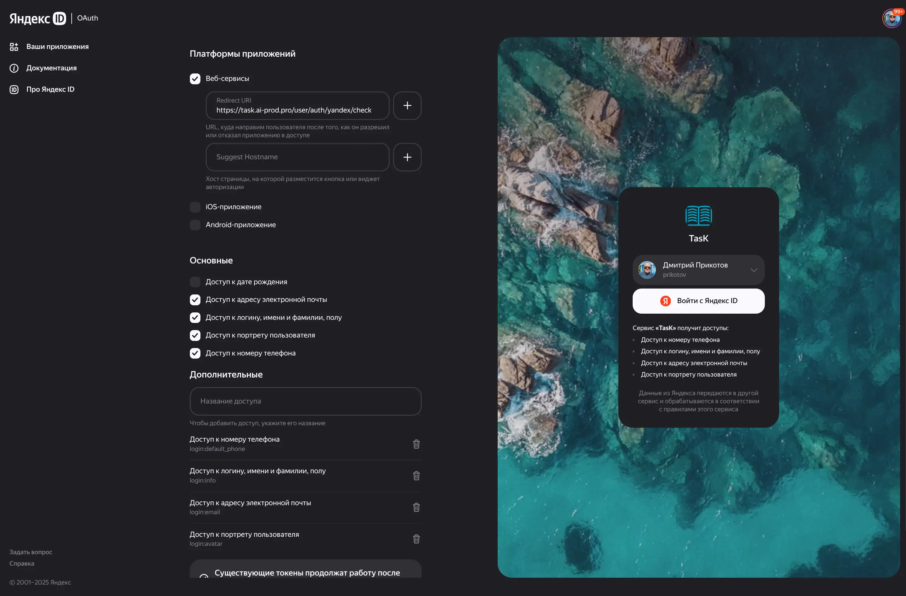

# Подключение Yandex ID для аутентификации

В качестве основного способа аутентификации в проекте используется Yandex ID. Ниже приведена пошаговая инструкция по настройке и подключению OAuth-приложения Yandex.

## 1. Регистрация приложения

1.  Перейдите на [платформу Yandex ID](https://oauth.yandex.ru/).
2.  Нажмите кнопку **«Создать клиент»**.

## 2. Настройка параметров

Вам будет предложена форма для заполнения. Укажите следующие данные:

### Основные данные

*   **Название сервиса:** Укажите произвольное имя, например, `TasK (dev)` для локальной разработки.

### Платформы

*   Активируйте опцию **«Веб-сервисы»**.
*   **Redirect URI:** укажите `https://task.localhost:8443/user/auth/yandex/check` для Development-окружения.
    *   Для **production-окружения** используйте актуальный домен: `https://task.ai-aid.pro/user/auth/yandex/check`.



### Доступы

Отметьте следующие разрешения, необходимые для корректной работы приложения:

*   **Доступ к адресу электронной почты** (`login:email`)
*   **Доступ к логину, имени и фамилии, полу** (`login:info`)
*   **Доступ к портрету пользователя** (`login:avatar`)
*   **Доступ к номеру телефона** (`login:default_phone`)



После заполнения всех полей нажмите кнопку **«Создать приложение»** внизу страницы.

## 3. Получение учетных данных

После создания приложения вы будете перенаправлены на страницу с его данными. Вам понадобятся:

*   **ID**
*   **Пароль**

## 4. Настройка окружения

Полученные `ID` и `Пароль` необходимо добавить в переменные окружения вашего проекта.

Скопируйте следующую секцию в ваш локальный файл `.env.local` и замените значения на полученные ранее:

```dotenv
###> yandex oauth ###
# Obtain credentials via Yandex ID
# https://oauth.yandex.ru/
YANDEX_CLIENT_ID="<ID вашего приложения>"
YANDEX_CLIENT_SECRET="<Пароль вашего приложения>"
###< yandex oauth ###
```

После выполнения этих шагов аутентификация через Yandex ID будет полностью настроена и готова к работе.

Если требуется настроить Yandex OAuth в песочнице, следуйте общим рекомендациям из раздела «Песочницы (Sandbox)» файла
[index.md](index.md).
