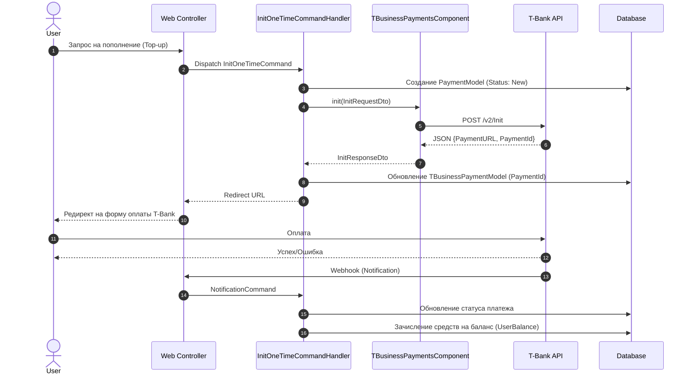
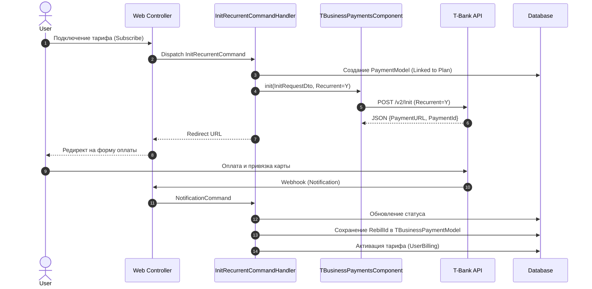
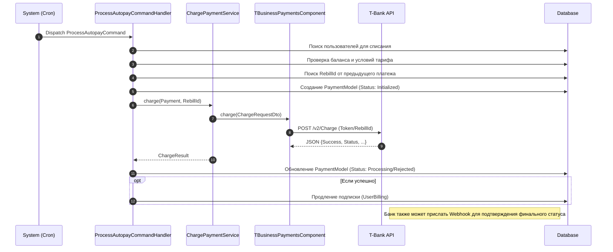

# Схемы работы с платежами (T-Business)

В системе реализовано три основных сценария проведения платежей. Ниже представлены диаграммы для каждого из них.

## 1. Разовое пополнение счета (One-time Payment)

Пользователь просто пополняет баланс на произвольную сумму.

## 2. Подключение тарифа с привязкой карты (Plan Subscription)

Пользователь выбирает тариф и оплачивает его. При этом происходит привязка карты (сохранение `RebillId`) для будущих списаний.

## 3. Автоматическое продление тарифа (Autopay)

Системный процесс (Cron) проверяет необходимость продления тарифа и списывает средства, используя сохраненный `RebillId`.

## Сводная таблица команд

| Сценарий | Command Class | T-Bank Method | Особенности |
|---|---|---|---|
| **Пополнение** | `InitOneTimeCommand` | `/v2/Init` | Обычный платеж, увеличивает баланс. |
| **Подписка** | `InitRecurrentCommand` | `/v2/Init` | Передается флаг рекуррентности. Сохраняется `RebillId`. |
| **Авто-списание** | `ProcessAutopayCommand` | `/v2/Charge` | Использует `RebillId`. Без участия пользователя. |
