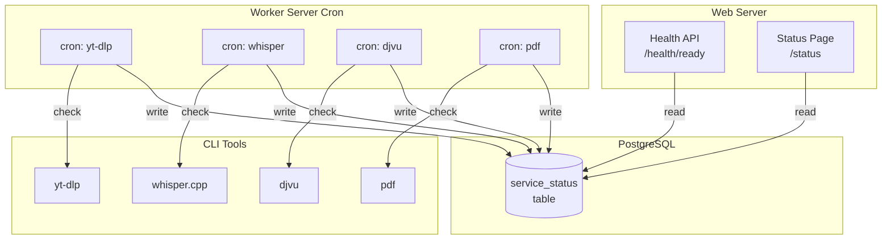
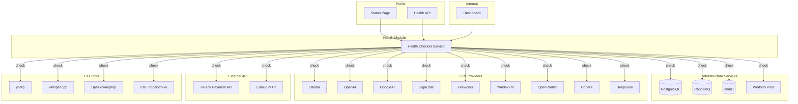

# EPIC-status-page: Комплексная система мониторинга и статус-страница

## Метаданные
- **Тип**: epic
- **Дата создания**: 2026-02-12
- **Ценность**: V3
- **Сложность**: C4
- **Приоритет**: P1
- **Автор**: system_analyst
- **Исполнитель**: —
- **Статус**: todo

## 1. Концепция и Цель
### Story (User Story)
Как пользователь платформы TasK,
я хочу видеть актуальный статус всех сервисов системы,
чтобы понимать доступность функций и планировать свою работу.

### Цель (SMART)
Реализовать комплексную систему мониторинга, включающую:
1) публичную status page с отображением статуса сервисов и истории инцидентов;
2) внутренний dashboard для команды с детальной информацией о состоянии системы;
3) health API эндпоинты для внешних мониторингов и ручной проверки.

Система должна покрывать мониторинг: PostgreSQL, RabbitMQ, MinIO, PHP-FPM, воркеров, LLM providers (9 провайдеров), CLI инструментов (4 компонента), внешних API (T-Bank, Email).

## 2. Границы (Scope)
**In Scope (Что делаем):**
- Health API эндпоинты (`/health`, `/health/ready`)
- Проверки доступности инфраструктуры: PostgreSQL, RabbitMQ, MinIO
- Проверки LLM providers: Ollama, OpenAI, GoogleAI, GigaChat, Fireworks, YandexFm, OpenRouter, Cohere, DeepSeek
- Проверки внешних API: T-Bank (T-Business Payment API), Email/SMTP сервис
- Проверки программных компонентов: yt-dlp, whisper.cpp, диаризация, DjVu конвертация, PDF обработка
- Публичная status page с историей инцидентов
- Внутренний dashboard с метриками сервисов
- Мониторинг воркеров и очередей RabbitMQ
- Алертинг через существующий Notification module

**Out of Scope (Чего НЕ делаем):**
- Prometheus/Grafana интеграция (отдельный эпик)
- Метрики производительности (latency, throughput)
- Автоматическое управление инцидентами
- Мобильное приложение для мониторинга
- SLA/SLO расчёты и отчёты

## 3. Требования (MoSCoW)

### 🔴 Must Have (Блокирующие требования)
- [x] Health API: `GET /health` и `GET /health/ready` — ✅ Phase 1
- [x] Проверка доступности PostgreSQL, RabbitMQ, MinIO — ✅ Phase 1
- [x] Проверка статуса LLM providers (базовая) — ✅ Phase 4
- [x] Проверка работоспособности программных компонентов (yt-dlp, whisper.cpp, djvu, pdf) — ✅ Phase 2
- [x] Публичная status page с текущим статусом сервисов — ✅ Phase 5
- [x] Unit и Integration тесты для health checks — ✅ Phase 1, Phase 2, Phase 3, Phase 4

### 🟡 Should Have (Важные требования)
- [x] Внутренний dashboard с детальной информацией — ✅ Phase 7 (PR #2131)
- [x] История инцидентов на status page — ✅ Phase 6
- [ ] Мониторинг длин очередей RabbitMQ — Phase 7
- [x] Проверка внешних API (T-Bank, Email/SMTP) — ✅ Phase 3
- [ ] Алертинг при смене статуса сервиса — Phase 8

### 🟢 Could Have (Желательно)
- [ ] RSS/Atom feed для подписки на инциденты
- [ ] Email уведомления о смене статуса
- [ ] Экспорт метрик в формате Prometheus
- [ ] Виджет для встраивания на внешние сайты

### ⚫ Won't Have (Не в этот раз)
- [ ] Интеграция с внешними мониторингами (Pingdom, UptimeRobot)
- [ ] SLO/SLA расчёты и отчёты
- [ ] Автоматическое создание тикетов в Jira
- [ ] Grafana dashboards

## 4. Техническое решение (Solution Design)

### Архитектура

Создаётся новый модуль `src/Module/Health/` с DDD-структурой:

```
src/Module/Health/
├── Domain/
│   ├── Entity/
│   │   └── ServiceStatus.php
│   ├── ValueObject/
│   │   ├── ServiceName.php
│   │   ├── ServiceStatusEnum.php      # operational|degraded|outage|maintenance
│   │   ├── ServiceCategoryEnum.php    # infrastructure|llm|external_api|cli_tool
│   │   └── HealthCheckResult.php
│   ├── Repository/
│   │   └── ServiceStatus/
│   │       └── ServiceStatusRepositoryInterface.php
│   └── Service/
│       └── HealthChecker/
│           ├── HealthCheckerInterface.php
│           ├── HealthCheckerServiceInterface.php
│           ├── CheckYtDlpHealthServiceInterface.php       # Integration слой для CLI tools
│           ├── CheckWhisperHealthServiceInterface.php
│           ├── CheckDjvuHealthServiceInterface.php
│           └── CheckPdfHealthServiceInterface.php
├── Application/
│   ├── Dto/
│   │   └── SystemHealthDto.php
│   ├── UseCase/
│   │   ├── Query/
│   │   │   ├── GetSystemHealth/
│   │   │   │   ├── GetSystemHealthQuery.php
│   │   │   │   └── GetSystemHealthQueryHandler.php
│   │   │   └── GetServiceStatus/
│   │   │       ├── GetServiceStatusQuery.php
│   │   │       └── GetServiceStatusQueryHandler.php
│   │   └── Command/
│   │       └── UpdateServiceStatus/
│   │           ├── UpdateServiceStatusCommand.php
│   │           └── UpdateServiceStatusCommandHandler.php
│   └── Service/
│       └── HealthChecker/
│           └── HealthCheckerRegistryService.php
├── Infrastructure/
│   ├── Component/
│   │   └── HealthCheck/
│   │       ├── DatabaseHealthCheckComponent.php
│   │       ├── DatabaseHealthCheckComponentInterface.php
│   │       ├── RabbitMqHealthCheckComponent.php
│   │       ├── RabbitMqHealthCheckComponentInterface.php
│   │       ├── MinioHealthCheckComponent.php
│   │       └── MinioHealthCheckComponentInterface.php
│   ├── Repository/
│   │   └── ServiceStatus/
│   │       └── ServiceStatusRepository.php
│   └── Service/
│       └── HealthChecker/
│           ├── DatabaseHealthCheckerService.php
│           ├── RabbitMqHealthCheckerService.php
│           └── MinioHealthCheckerService.php
├── Integration/
│   └── Service/
│       └── HealthChecker/
│           ├── CheckYtDlpHealthService.php           # Вызывает Source Module через QueryBus
│           ├── CheckWhisperHealthService.php         # Вызывает SpeechToText Module через QueryBus
│           ├── CheckDjvuHealthService.php            # Вызывает Source Module через QueryBus
│           ├── CheckPdfHealthService.php             # Вызывает Source Module через QueryBus
│           ├── CheckOllamaHealthService.php          # Вызывает Llm Module через QueryBus
│           ├── CheckOpenAiHealthService.php          # Вызывает Llm Module через QueryBus
│           ├── CheckGoogleAiHealthService.php        # Вызывает Llm Module через QueryBus
│           ├── CheckGigaChatHealthService.php        # Вызывает Llm Module через QueryBus
│           ├── CheckFireworksHealthService.php       # Вызывает Llm Module через QueryBus
│           ├── CheckYandexFmHealthService.php        # Вызывает Llm Module через QueryBus
│           ├── CheckOpenRouterHealthService.php      # Вызывает Llm Module через QueryBus
│           ├── CheckCohereHealthService.php          # Вызывает Llm Module через QueryBus
│           ├── CheckDeepSeekHealthService.php        # Вызывает Llm Module через QueryBus
│           ├── CheckTBankHealthService.php           # Вызывает Billing Module через QueryBus
│           └── CheckEmailHealthService.php           # Вызывает Notification Module через QueryBus
└── Resource/
    └── config/
        └── services.yaml
```

### ADR-001: CLI Tools Health Checks — Integration слой через QueryBus + Cron/DB

**Дата:** 2026-02-14
**Статус:** Approved

#### Проблема
1. **Дублирование конфигурации:** YtDlpComponent уже существует в Source Module, создание отдельного компонента в Health Module приведёт к дублированию.
2. **Распределённая архитектура:** CLI tools (yt-dlp, whisper.cpp, djvu, pdf) установлены только на Worker сервере, а health checks должны работать с Web сервера.

#### Решение

**1. Integration слой через Query Bus:**

Согласно `docs/conventions/layers/application.md`, из внешних модулей можно вызывать только Use Cases (Query/Command handlers).

```
Health Module / Integration
    ↓ вызывает через QueryBus
Source Module / Application UseCase (Query)
    ↓ использует
Source Module / Infrastructure (существующий YtDlpComponent)
```

**2. Cron + DB для Worker CLI tools:**

Каждый CLI tool проверяется отдельной cron записью для параллельного выполнения:

```bash
# crontab на Worker Server
* * * * * bin/console health:check:cli-tool yt-dlp
* * * * * bin/console health:check:cli-tool whisper
* * * * * bin/console health:check:cli-tool djvu
* * * * * bin/console health:check:cli-tool pdf
```

**Преимущества:**
- Параллельное выполнение проверок
- Изоляция: одна долгая проверка не блокирует другие
- Независимые таймауты для каждого инструмента
- Гибкая настройка частоты для каждого сервиса

#### Структура Query UseCase в Source Module

```
src/Module/Source/
├── Application/
│   ├── Dto/
│   │   └── YtDlpHealthDto.php                    # isHealthy, version, errorMessage
│   └── UseCase/
│       └── Query/
│           └── CheckYtDlpHealth/
│               ├── CheckYtDlpHealthQuery.php
│               └── CheckYtDlpHealthQueryHandler.php
```

#### Структура Integration Service в Health Module

```
src/Module/Health/
├── Domain/
│   └── Service/
│       └── HealthChecker/
│           └── CheckYtDlpHealthServiceInterface.php  # Interface
└── Integration/
    └── Service/
        └── HealthChecker/
            └── CheckYtDlpHealthService.php           # Implementation через QueryBus
```

#### Console Command для Cron

```
apps/console/
└── src/Command/
    └── Health/
        └── HealthCheckCliToolCommand.php             # bin/console health:check:cli-tool <service>
```

### ADR-002: External API & LLM Health Checks — Integration слой через QueryBus

**Дата:** 2026-02-16
**Статус:** Approved

#### Проблема
1. **Дублирование конфигурации:** LLM компоненты (OllamaComponent, OpenAiComponent и др.) уже существуют в Llm Module, TBusinessPaymentsComponent существует в Billing Module. Создание отдельных HealthCheck компонентов в Health Module приведёт к дублированию конфигурации (HttpClient, credentials, timeouts).
2. **Сложность поддержки:** При изменении конфигурации LLM/API провайдеров пришлось бы обновлять конфигурацию в двух местах.

#### Решение

**Integration слой через Query Bus (расширение ADR-001):**

```
Health Module / Integration Service
    ↓ вызывает через QueryBus
Llm Module / Application UseCase (Query)
    ↓ использует
Llm Module / Infrastructure (существующий Component)
```

То же самое для External API:

```
Health Module / Integration Service
    ↓ вызывает через QueryBus
Billing Module / Application UseCase (Query)
    ↓ использует
Billing Module / Integration (существующий TBusinessPaymentsComponent)
```

#### Общий pattern для LLM/External API health checks

1. **DTO** размещается рядом с Query UseCase в `{Module}/Application/UseCase/Query/CheckXxxHealth/` с полями: isHealthy, errorMessage, дополнительные метрики
2. **Query UseCase** в соответствующем модуле (Llm, Billing, Notification)
3. **Integration Service** в Health Module (вызывает Query через QueryBus)

#### Преимущества
- Переиспользование существующей конфигурации
- Нет дублирования кода
- Единая точка настройки credentials
- Соответствие конвенции project layers

#### Требование: размещение DTO
**ВАЖНО:** DTO размещается рядом с UseCase, который его возвращает: `{Module}/Application/UseCase/Query/CheckXxxHealth/XxxHealthDto.php`

#### Структура для LLM провайдеров (пример Ollama)

```
src/Module/Llm/
├── Application/
│   └── UseCase/
│       └── Query/
│           └── CheckOllamaHealth/
│               ├── OllamaHealthDto.php              # новый
│               ├── CheckOllamaHealthQuery.php       # новый
│               └── CheckOllamaHealthQueryHandler.php # использует OllamaComponent.tags()

src/Module/Health/
├── Domain/
│   └── Service/
│       └── HealthChecker/
│           └── CheckOllamaHealthServiceInterface.php # новый
└── Integration/
    └── Service/
        └── HealthChecker/
            └── CheckOllamaHealthService.php          # вызывает Query через QueryBus
```

#### Диаграмма потоков CLI Tools



### Структура apps/web для Status Page

```
apps/web/src/Module/Health/
├── Controller/
│   ├── StatusController.php          # /status - публичная страница
│   └── Admin/
│       └── DashboardController.php   # /admin/dashboard - внутренний dashboard
├── Route/
│   └── HealthRoute.php
├── Security/
│   └── Health/
│       └── PermissionEnum.php
├── Resource/
│   ├── config/
│   │   └── services.yaml
│   └── templates/
│       ├── status/
│       │   └── index.html.twig
│       └── admin/
│           └── dashboard/
│               └── index.html.twig
└── HealthModule.php
```

### Структура apps/api для Health API

```
apps/api/src/v1/Module/Health/
├── Controller/
│   ├── LivenessController.php      # GET /health
│   └── ReadinessController.php     # GET /health/ready
├── Route/
│   └── HealthRoute.php
└── Resource/
    └── config/
        └── services.yaml
```

**Примечание:** В `apps/api/src/v1/Controller/HealthController.php` уже существует базовый health endpoint. Новые контроллеры создаются в Module для детальных readiness проверок.

### Диаграмма потоков



### Интеграции

| Компонент | Интеграция | Примечание |
|-----------|------------|------------|
| Notification | Алертинг | Использовать существующий module |
| RabbitMQ Management API | Очереди | HTTP API для статистики |
| MinIO Health Check | S3 API | HeadBucket request |
| Doctrine DBAL | PostgreSQL | Simple SELECT 1 |
| YtDlpComponent | yt-dlp | Version check + test download |
| WhisperCppCliComponent | whisper.cpp | Version check + model availability |
| DjvuConversionService | DjVu | ddjvu binary check |
| T-Business Billing | T-Bank API | Check payment API availability |

### Публичная Status Page

Располагается в `apps/web/src/Module/Status/`:
- URL: `/status` или поддомен `status.task.com`
- Шаблон: Bootstrap 5 Phoenix theme
- Компоненты: статус сервисов, история инцидентов, uptime badge

### Health API Endpoints

| Endpoint | Purpose | Response |
|----------|---------|----------|
| `GET /health` | Liveness probe | 200 OK или 503 |
| `GET /health/ready` | Readiness probe | Детальный статус зависимостей |
| `GET /api/v1/health/services` | Детальный статус (internal) | JSON со всеми сервисами |

## 5. План реализации (Tasks)

### Phase 1: Foundation (Health Module) ✅
- [x] [TASK-status-health-domain](done/TASK-status-health-domain.todo.md) — Создать Domain слой: Entity, ValueObject, Enum, Repository interfaces
- [x] [TASK-status-health-application](done/TASK-status-health-application.todo.md) — Создать Application слой: UseCases, DTO, Service interfaces
- [x] [TASK-status-health-infra-core](done/TASK-status-health-infra-core.todo.md) — Infrastructure: PostgreSQL health checker component и service
- [x] [TASK-status-health-infra-rabbitmq](done/TASK-status-health-infra-rabbitmq.todo.md) — Infrastructure: RabbitMQ health checker component и service
- [x] [TASK-status-health-infra-minio](done/TASK-status-health-infra-minio.todo.md) — Infrastructure: MinIO health checker component и service
- [x] [TASK-status-health-api](done/TASK-status-health-api.todo.md) — Создать Health API эндпоинты в apps/api

### Phase 2: CLI Tools Health Checks (Integration Layer + Cron/DB) ✅

> **ADR-001:** CLI tools health checks используют Integration слой через QueryBus и Cron+DB подход.
> См. детальное описание в секции ADR-001 выше.

**Общий pattern для всех CLI tools:**
1. Query UseCase в соответствующем модуле (Source/SpeechToText)
2. Integration Service в Health Module (вызывает Query через QueryBus)
3. Console Command для запуска через cron на Worker Server

**Задачи:**
- [x] [TASK-status-cli-ytdlp](done/TASK-status-cli-ytdlp.todo.md) — Health check для yt-dlp: Query UseCase в Source, Integration Service, тесты
- [x] [TASK-status-cli-whisper](done/TASK-status-cli-whisper.todo.md) — Health check для whisper.cpp: Query UseCase в SpeechToText, Integration Service, тесты
- [x] [TASK-status-cli-djvu](done/TASK-status-cli-djvu.todo.md) — Health check для DjVu конвертера: Query UseCase в Source, Integration Service, тесты
- [x] [TASK-status-cli-pdf](done/TASK-status-cli-pdf.todo.md) — Health check для PDF обработчика: Query UseCase в Source (getVersion добавлен в PdfinfoComponent), Integration Service, тесты
- [x] [TASK-status-cli-console](done/TASK-status-cli-console.todo.md) — Console команда `health:check:cli-tool` для cron на Worker Server (с опциями --all, --dry-run, --json)

### Phase 3: External API Health Checks (Integration Layer) ✅

> **ADR-002:** External API health checks используют Integration слой через QueryBus.
> См. детальное описание в секции ADR-002 выше.

**Общий pattern:**
1. Query UseCase в соответствующем модуле (Billing, Notification)
2. DTO в `{Module}/Application/Dto/`
3. Integration Service в Health Module (вызывает Query через QueryBus)

**Задачи:**
- [x] [TASK-status-ext-tbank](done/TASK-status-ext-tbank.todo.md) — Health check для T-Bank API: Query UseCase в Billing, Integration Service, тесты (PR #2117)
- [x] [TASK-status-ext-email](done/TASK-status-ext-email.todo.md) — Health check для Email/SMTP: Query UseCase в Notification, Integration Service, тесты (PR #2118)

### Phase 4: LLM Providers Health Checks (Integration Layer) ✅

> **ADR-002:** LLM health checks используют Integration слой через QueryBus.
> См. детальное описание в секции ADR-002 выше.

**Общий pattern:**
1. Query UseCase в Llm Module
2. DTO размещается рядом с Query UseCase в `Llm/Application/UseCase/Query/CheckXxxHealth/`
3. Integration Service в Health Module (вызывает Query через QueryBus)

**Задачи:**
- [x] [TASK-status-llm-ollama](done/TASK-status-llm-ollama.todo.md) — Health check для Ollama: Query UseCase, Integration Service, тесты (PR #2121)
- [x] [TASK-status-llm-openai](done/TASK-status-llm-openai.todo.md) — Health check для OpenAI: Query UseCase, Integration Service, тесты (PR #2121)
- [x] [TASK-status-llm-googleai](done/TASK-status-llm-googleai.todo.md) — Health check для GoogleAI: Query UseCase, Integration Service, тесты (PR #2121)
- [x] [TASK-status-llm-gigachat](done/TASK-status-llm-gigachat.todo.md) — Health check для GigaChat: Query UseCase, Integration Service, тесты (PR #2121)
- [x] [TASK-status-llm-fireworks](done/TASK-status-llm-fireworks.todo.md) — Health check для Fireworks: Query UseCase, Integration Service, тесты (PR #2121)
- [x] [TASK-status-llm-yandexfm](done/TASK-status-llm-yandexfm.todo.md) — Health check для YandexFm: Query UseCase, Integration Service, тесты (PR #2121)
- [x] [TASK-status-llm-openrouter](done/TASK-status-llm-openrouter.todo.md) — Health check для OpenRouter: Query UseCase, Integration Service, тесты (PR #2121)
- [x] [TASK-status-llm-cohere](done/TASK-status-llm-cohere.todo.md) — Health check для Cohere: Query UseCase, Integration Service, тесты (PR #2121)
- [x] [TASK-status-llm-deepseek](done/TASK-status-llm-deepseek.todo.md) — Health check для DeepSeek: Query UseCase, Integration Service, тесты (PR #2121)

### Phase 5: Public Status Page (MVP)
- [x] [TASK-status-public-page](done/TASK-status-public-page.todo.md) — Создать публичную status page в apps/web: контроллеры, шаблоны (PR #2123)

### Phase 6: Incident Management

**Структура задач:**
1. **Domain слой** — Incident entity, ValueObjects (IncidentId, IncidentTitle, IncidentDescription), Enums (IncidentStatusEnum, IncidentSeverityEnum), Repository interface с Criteria
2. **Infrastructure слой** — IncidentRepository implementation, CriteriaMapper, InMemory repository, Migration
3. **Application слой + UI** — Commands/Queries (Create/Update/Resolve/Delete, Get/List), DTO, Admin CRUD controllers, Status page integration

**Задачи:**
- [x] [TASK-status-incident-entity](done/TASK-status-incident-entity.todo.md) — Domain: Incident entity, ValueObjects, Enums, Repository interface с Criteria (PR #2124)
- [x] [TASK-status-incident-storage](done/TASK-status-incident-storage.todo.md) — Infrastructure: IncidentRepository, CriteriaMapper, InMemory repository, Migration (PR #2125)
- [x] [TASK-status-incident-ui](done/TASK-status-incident-ui.todo.md) — Application: Commands/Queries/DTO; UI: Admin CRUD, Status page integration (PR #2126)

### Phase 7: Internal Dashboard
- [x] [TASK-status-dashboard](done/TASK-status-dashboard.todo.md) — Создать внутренний dashboard для команды (PR #2131)
- [ ] [TASK-status-workers-monitoring](TASK-status-workers-monitoring.todo.md) — Мониторинг воркеров и очередей RabbitMQ

### Phase 8: Integration & Alerting
- [ ] [TASK-status-alerting](TASK-status-alerting.todo.md) — Интеграция с Notification module для алертинга

## 6. Definition of Done (DoD) эпика
- [ ] Все `Must Have` требования реализованы
- [ ] Health API отвечает корректно при падении любого сервиса
- [ ] Status page доступна публично и отображает актуальный статус
- [ ] Dashboard доступен авторизованным пользователям
- [ ] Unit тесты покрывают Domain и Application слои (>= 80%)
- [ ] Integration тесты проверяют реальные подключения к сервисам
- [ ] `make check` проходит без ошибок
- [ ] Документация API обновлена

## 7. Инструкция по релизу (Release Notes / Deployment)
- [ ] Применить миграции для таблицы incident_history
- [ ] Настроить переменные окружения для health checks (таймауты, thresholds)
- [ ] Настроить периодический health check через cron или worker
- [ ] Проверить работу алертов в тестовом окружении

## 8. Риски и Зависимости

### Риски
| Риск | Вероятность | Влияние | Митигация |
|------|-------------|---------|-----------|
| Timeout при проверке LLM providers | Высокая | Низкое | Асинхронные проверки с кэшированием |
| Ложные срабатывания алертов | Средняя | Среднее | Настройка thresholds и debounce |
| Нагрузка от частых health checks | Низкая | Низкое | Кэширование результатов на 30-60 сек |
| Долгое выполнение CLI tool checks | Средняя | Низкое | Timeout + легковесные тесты (version check) |
| Недоступность внешних API | Средняя | Низкое | Retry механизм + graceful degradation |

### Зависимости
- Существующий Notification module для алертинга
- RabbitMQ Management API (должен быть включён)

## 9. Источники
- [x] [Infrastructure Containers](../docs/architecture/infrastructure-containers.md)
- [x] [Llm Module Components](../src/Module/Llm/Infrastructure/Component/)
- [x] [Notification Module](../src/Module/Notification/)
- [x] [YtDlp Component](../src/Module/Source/Infrastructure/Component/YtDlp/)
- [x] [WhisperCpp Component](../src/Module/SpeechToText/Infrastructure/Component/WhisperCppCli/)
- [x] [DjvuConversion Service](../src/Module/Source/Infrastructure/Service/Source/Djvu/)
- [x] [T-Business Billing Integration](../src/Module/Billing/Integration/Service/Payment/TBusiness/)
- [x] [ADR-0001: CLI Tools Health Check Architecture](../docs/architecture/adr/ADR-0001-cli-tools-health-check-architecture.md)
- [x] [ADR-0002: External API & LLM Health Check Architecture](../docs/architecture/adr/ADR-0002-external-api-llm-health-check-architecture.md)

## 10. Комментарии

### Особенности продакшн-окружения
В проде отсутствует контейнеризация (кроме MinIO), поэтому:
- Health checks должны работать с локальными сервисами
- Нет необходимости в проверке контейнерных абстракций
- MinIO health check должен учитывать контейнерную изоляцию

### Переиспользование существующего кода
- `NotificationModule` — готовая инфраструктура для алертов
- `AppOption` — можно использовать для конфигурации thresholds

## История изменений
| Дата | Автор | Изменение |
| :--- | :--- | :--- |
| 2026-02-12 | system_analyst | Создание эпика |
| 2026-02-12 | system_analyst | Расширение scope: добавлен мониторинг CLI инструментов и внешних API |
| 2026-02-12 | system_analyst | Корректировка архитектуры модуля согласно конвенциям проекта |
| 2026-02-12 | system_analyst | Добавлены пропущенные LLM провайдеры: Cohere, DeepSeek |
| 2026-02-12 | system_analyst | Декомпозиция задач: 13 задач → 29 задач в 7 фазах |
| 2026-02-12 | system_analyst | Удалена избыточная задача TASK-status-llm-balances |
| 2026-02-12 | system_analyst | Self-review: исправлены противоречия в Goal, Scope, Mermaid диаграмме |
| 2026-02-12 | system_analyst | Удалены упоминания ProviderBalance — не относится к health monitoring |
| 2026-02-12 | system_analyst | Убрана Traefik/K8s интеграция (нет в проде): endpoints в TASK-status-health-api |
| 2026-02-12 | system_analyst | Удалена дублирующая задача TASK-status-health-endpoints (входит в TASK-status-health-api) |
| 2026-02-12 | system_analyst | Self-review задач: исправлены пути LLM/External API с Infrastructure на Integration |
| 2026-02-12 | system_analyst | Исправлена структура apps: `apps/api/src/v1/Module/` и `apps/web/src/Module/Health/` |
| 2026-02-12 | backend_developer | Выполнена задача TASK-status-health-domain (PR #2092) |
| 2026-02-13 | backend_developer | Выполнена задача TASK-status-health-application (PR #2099) |
| 2026-02-13 | backend_developer | Выполнена задача TASK-status-health-infra-core (PR #2102) |
| 2026-02-14 | backend_developer | Выполнена задача TASK-status-health-infra-rabbitmq (PR #2104) |
| 2026-02-14 | backend_developer | Выполнена задача TASK-status-health-infra-minio (PR #2105) |
| 2026-02-14 | backend_developer | Выполнена задача TASK-status-health-api (PR #2106) |
| 2026-02-14 | backend_developer | **Phase 1 завершена ✅** — Health Module полностью реализован (Domain, Application, Infrastructure для PostgreSQL/RabbitMQ/MinIO, Health API endpoints). Можно переходить к Phase 2: CLI Tools Health Checks |
| 2026-02-14 | backend_developer | **ADR-001:** Архитектурное решение для CLI Tools — Integration слой через QueryBus + Cron/DB подход. Обновлена структура модуля и Phase 2 задачи |
| 2026-02-15 | backend_developer | Выполнена задача TASK-status-cli-ytdlp — добавлены Unit тесты для CheckYtDlpHealthQueryHandler |
| 2026-02-15 | backend_developer | Выполнена задача TASK-status-cli-whisper — Health check для whisper.cpp (WhisperHealthDto, WhisperHealthCheckComponent, QueryHandler, WhisperHealthCheckerService, Unit тесты) |
| 2026-02-15 | backend_developer | Выполнена задача TASK-status-cli-djvu — Health check для DjVu конвертера (DjvuHealthDto, QueryHandler использует существующий DjvuComponent, DjvuHealthCheckerService, Unit тесты) |
| 2026-02-15 | backend_developer | Выполнена задача TASK-status-cli-pdf — Health check для PDF (PdfHealthDto, QueryHandler использует существующий PdfinfoComponent.getVersion(), PdfHealthCheckerService, Unit тесты) (PR #2113) |
| 2026-02-15 | backend_developer | Выполнена задача TASK-status-cli-console — Console команда `health:check:cli-tool` с опциями --all, --dry-run, --json, Unit тесты |
| 2026-02-15 | backend_developer | **Phase 2 завершена ✅** — CLI Tools Health Checks полностью реализованы (yt-dlp, whisper.cpp, djvu, pdf + console команда для cron) |
| 2026-02-15 | system_analyst | **Review Phase 2:** проверена завершённость задач, актуализированы MoSCoW требования, перемещён TASK-status-health-infra-core в done/ |
| 2026-02-16 | system_analyst | **ADR-002:** Архитектурное решение для External API & LLM Health Checks — Integration слой через QueryBus вместо создания новых HealthCheck компонентов; расширение существующих компонентов (OllamaComponent, OpenAiComponent, TBusinessPaymentsComponent и др.); обновлены все задачи Phase3 и Phase4 |
| 2026-02-16 | backend_developer | Выполнена задача TASK-status-ext-tbank (PR #2117) — Health check для T-Bank API: TBankHealthDto, CheckTBankHealthQuery/Handler, TBankHealthCheckServiceInterface, TBankHealthCheckerService, Unit и Integration тесты |
| 2026-02-16 | backend_developer | Выполнена задача TASK-status-ext-email (PR #2118) — Health check для Email/SMTP: EmailHealthDto, CheckEmailHealthQuery/Handler, EmailHealthCheckerService, Unit и Integration тесты |
| 2026-02-16 | backend_developer | **Phase 3 завершена ✅** — External API Health Checks полностью реализованы (T-Bank API, Email/SMTP через Integration слой по ADR-002). Можно переходить к Phase 4: LLM Providers Health Checks |
| 2026-02-16 | system_analyst | **Review Phase 3:** проверена завершённость задач, актуализированы MoSCoW требования, создана документация (ADR-0002, health-module.md) (PR #2119) |
| 2026-02-16 | backend_developer | **Phase 4 завершена ✅** — LLM Providers Health Checks полностью реализованы (9 провайдеров: Ollama, OpenAI, GoogleAI, GigaChat, Fireworks, YandexFm, OpenRouter, Cohere, DeepSeek через Integration слой по ADR-002) (PR #2121). Можно переходить к Phase 5: Public Status Page |
| 2026-02-16 | system_analyst | **Review Phase 4:** проверена завершённость задач (все 9 в done/), актуализированы ADR-0002 и health-module.md |
| 2026-02-16 | system_analyst | **Реструктуризация фаз:** Phase 5 (Status Page) разбита на Phase5 (Public Status Page MVP) и Phase6 (Incident Management). Бывшие Phase6 и Phase7 стали Phase7 и Phase8 соответственно |
| 2026-02-16 | system_analyst | **Детализация Phase 6:** обновлены задачи инцидентов согласно конвенциям проекта (src/AGENTS.md): добавлены Criteria/Repository interfaces, CriteriaMapper, InMemory repository, Application layer (Commands, Queries, DTO), уточнены пути размещения файлов |
| 2026-02-16 | system_analyst | **Именование классов:** исправлены имена по конвенциям (docs/conventions/): Entity→IncidentModel, VO→IncidentTitleVo/IncidentDescriptionVo, DTO→IncidentDto, Enum→IncidentStatusEnum/IncidentSeverityEnum |
| 2026-02-17 | backend_developer | **Phase 5 завершена ✅** — Public Status Page MVP реализован (StatusController, Twig templates, Bootstrap 5 Phoenix theme, 30-sec caching, E2E tests) (PR #2123). Можно переходить к Phase 6: Incident Management |
| 2026-02-17 | backend_developer | Выполнена задача TASK-status-incident-entity — Domain слой: IncidentModel, IncidentTitleVo, IncidentDescriptionVo, IncidentStatusEnum, IncidentSeverityEnum, IncidentRepositoryInterface, IncidentFindCriteria (PR #2124) |
| 2026-02-17 | backend_developer | Выполнена задача TASK-status-incident-storage — Infrastructure слой: IncidentRepository (Doctrine), CriteriaMapper, InMemoryIncidentRepository, Migration (PR #2125) |
| 2026-02-17 | backend_developer | **Phase 6 завершена ✅** — Incident Management полностью реализован (Domain, Infrastructure, Application + UI: Commands/Queries/DTO, Admin CRUD controllers, Status page integration) (PR #2126) |
| 2026-02-18 | system_analyst | **Review Phase 5 & Phase 6:** проверена завершённость задач (все в done/), актуализированы MoSCoW требования (история инцидентов отмечена выполненной), обновлена документация health-module.md (добавлены секции Status Page и Incident Management) (PR #2129) |
| 2026-02-19 | frontend_developer | Выполнена задача TASK-status-dashboard — Admin Dashboard: DashboardController, фильтрация по категории/статусу, Bootstrap 5 шаблон, E2E и Unit тесты (PR #2131) |
