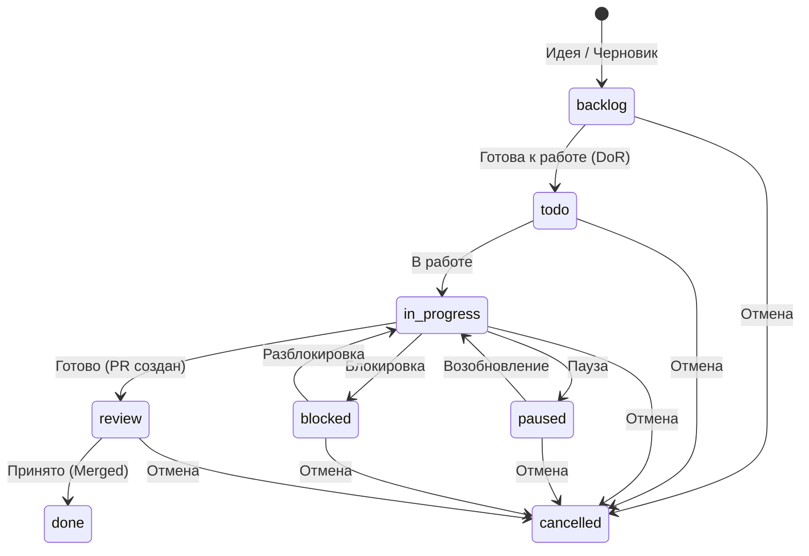

# Статусы задач и эпиков

Список допустимых статусов для использования в поле `Статус`.

## Активные задачи (папка `todo/`)
Задачи, которые находятся в активной работе или готовы к ней.

- **todo**: Задача запланирована и готова к выполнению.
- **in_progress**: Активная работа над задачей.
- **paused**: Работа приостановлена (смена приоритетов, не блокировка).
- **blocked**: Работа остановлена из-за внешних факторов/зависимостей.
- **review**: Результат на проверке (Code Review).

## Бэклог (папка `todo/backlog/`)
Задачи, отложенные на будущее или требующие уточнения.

- **backlog**: Задача в бэклоге.

## Завершенные (папка `todo/done/`)
Задачи, работа над которыми завершена.

- **done**: Задача полностью выполнена и принята.

## Отмененные (папка `todo/cancelled/`)
Задачи, работа над которыми отменена.

- **cancelled**: Задача отменена.

## Workflow движения задач

### Основные переходы
1.  **Создание:** Задача создается в `todo/backlog/` (статус `backlog`) или сразу в `todo/` (статус `todo`), если готова к работе.
2.  **В работу:** Из `backlog` перемещается в `todo/` и меняет статус на `todo`.
3.  **Выполнение:** При начале работы статус меняется на `in_progress`.
4.  **Приостановка/Блокировка:** При возникновении проблем статус меняется на `paused` или `blocked`. Файл остается в `todo/`.
5.  **Завершение:** После Code Review и Merge статус меняется на `done`, файл перемещается в `todo/done/`.
6.  **Отмена:** Если задача неактуальна, статус меняется на `cancelled`, файл перемещается в `todo/cancelled/`.
